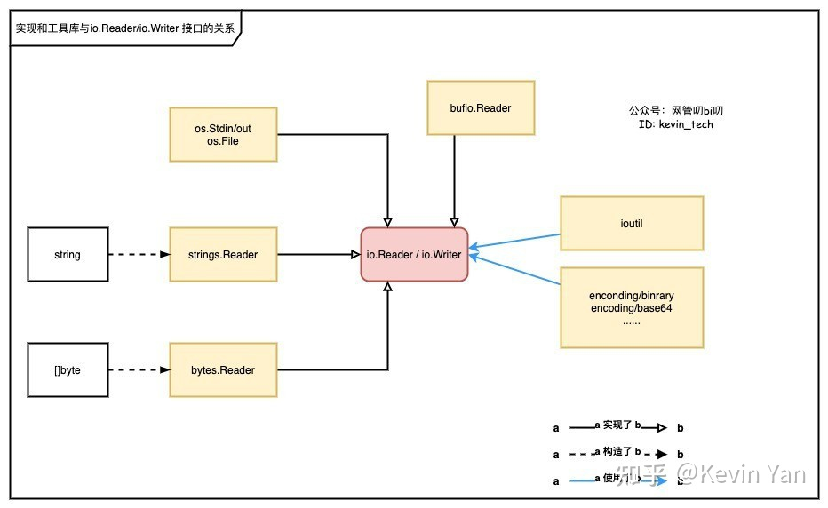

注意，接口本身并没有实际作用，而是接口定义的标准 + 其他 package 针对接口的适配实现，让 interface 变得很强，而且通用性很高

另外，因为 interface 具有很强的复用性，而且会在项目中长时间保留，所以 interface 的实现标准、约定一定要明确，interface 的 method 名字也要尽可能精确（当然，也仅仅是一个君子协定，编译器不可能智能到帮你检查实现是不是按照标准来的）

`io package = Reader interface + Writer interrface`


## 常见 interface 语义

### io.Reader

```go
// 最多读 len(p) 的数据，实际读取数据量将会通过 n 返回（0 <= n <= len(p)）
// 注意，是最多读出 len(p) 的数据，而不是 cap(p), 这是因为 Read() 没有返回新 slice 的返回值
// 所以你不能直接 append 诞生一个新的 slice，调用者压根没办法拿到这个 Read() 内部新生成的 slice
// 读到数据就返回，哪怕没有读满 len(p), 毕竟长时间 block 是个大问题
// Read reads up to len(p) bytes into p. It returns the number of bytes
// read (0 <= n <= len(p)) and any error encountered. Even if Read
// returns n < len(p), it may use all of p as scratch space during the call.
// If some data is available but not len(p) bytes, Read conventionally
// returns what is available instead of waiting for more.
//
// When Read encounters an error or end-of-file condition after
// successfully reading n > 0 bytes, it returns the number of
// bytes read. It may return the (non-nil) error from the same call
// or return the error (and n == 0) from a subsequent call.
// An instance of this general case is that a Reader returning
// a non-zero number of bytes at the end of the input stream may
// return either err == EOF or err == nil. The next Read should
// return 0, EOF.
//
// Callers should always process the n > 0 bytes returned before
// considering the error err. Doing so correctly handles I/O errors
// that happen after reading some bytes and also both of the
// allowed EOF behaviors.
//
// Implementations of Read are discouraged from returning a
// zero byte count with a nil error, except when len(p) == 0.
// Callers should treat a return of 0 and nil as indicating that
// nothing happened; in particular it does not indicate EOF.
//
// Implementations must not retain p.
type Reader interface {
	Read(p []byte) (n int, err error)
}
```


### io.Writer

```go
// Writer is the interface that wraps the basic Write method.
//
// Write writes len(p) bytes from p to the underlying data stream.
// It returns the number of bytes written from p (0 <= n <= len(p))
// and any error encountered that caused the write to stop early.
// Write must return a non-nil error if it returns n < len(p).
// Write must not modify the slice data, even temporarily.
//
// Implementations must not retain p.
// 约定：
// 如果无法全部写入，那么该方法就一定会返回一个错误。
// Write() 绝对不能对 p 做出任何的改动
type Writer interface {
	Write(p []byte) (n int, err error)
}
```


### io.ByteReader

> 一个个 byte 读取

```go
// ByteReader is the interface that wraps the ReadByte method.
//
// ReadByte reads and returns the next byte from the input or
// any error encountered. If ReadByte returns an error, no input
// byte was consumed, and the returned byte value is undefined.
//
// ReadByte provides an efficient interface for byte-at-time
// processing. A Reader that does not implement  ByteReader
// can be wrapped using bufio.NewReader to add this method.
type ByteReader interface {
	ReadByte() (byte, error)
}
```


### io.RuneReader

> 一个个 Rune 进行读取

```go
// RuneReader is the interface that wraps the ReadRune method.
//
// ReadRune reads a single UTF-8 encoded Unicode character
// and returns the rune and its size in bytes. If no character is
// available, err will be set.
type RuneReader interface {
   // 返回一个 rune，这个 rune 占用多少 bytes，有没 error
   ReadRune() (r rune, size int, err error)
}
```


### io.ReaderFrom

> object 能够从另一个 io.Reader 中读取数据，具体类型取决于实现
>
> - 一次性全部读取（`bytes.Buffer`）
> - stream 式读取

```go
// ReaderFrom is the interface that wraps the ReadFrom method.
//
// ReadFrom reads data from r until EOF or error.
// The return value n is the number of bytes read.
// Any error except EOF encountered during the read is also returned.
//
// The Copy function uses ReaderFrom if available.
type ReaderFrom interface {
	ReadFrom(r Reader) (n int64, err error)
}
```

- `ReaderFrom.ReadFrom()` 实际上是配合了 `io.Reader` 来用的。因为 `io.Reader` 提供了 `Read()` 的标准 interface，所以 `ReaderFrom.ReadFrom()` 在内部直接通过 `io.Reader.Read()` 来读取数据就好
  - 你可以看看 `bytes.Buffer.ReadFrom()` 的实现示例
- 注意，并没有规定究竟该不该 block，所以具体的行为取决于实现


### io.WriterTo

> 跟 `io.ReaderFrom` 十分类似，是搭配 `io.Writer` 使用的

```go
// WriterTo is the interface that wraps the WriteTo method.
//
// WriteTo writes data to w until there's no more data to write or
// when an error occurs. The return value n is the number of bytes
// written. Any error encountered during the write is also returned.
//
// The Copy function uses WriterTo if available.
type WriterTo interface {
	WriteTo(w Writer) (n int64, err error)
}
```


## 具体实现 package

### bytes.Buffer

```go
// byte.Buffer 的整个抽象是：我不想管要怎么维护底层 buf 的 size，
// 每次我 Buffer.Write() 总能把全部数据写进去; Buffer.Read() 的时候，总能读出里面的数据，并且自动缩小
// 底层 buf 的维护工作，由 bytes.Buffer 的 method 封装好了

// A Buffer is a variable-sized buffer of bytes with Read and Write methods.
// The zero value for Buffer is an empty buffer ready to use.
// buf[start <---> off <---> len(buf) <---> cap(buf)]
// start    <---> off     : 已经读取过的数据
// off      <---> len(buf): 还没有读取的书数据
// len(buf) <---> cap(buf): 还可以装下多少数据
// 用的时候直接 bytes.Buffer{} 就好，Buffer.buf 在 Write() 的时候，回自动增长的
type Buffer struct {
	buf      []byte // contents are the bytes buf[off : len(buf)]
	off      int    // read at &buf[off], write at &buf[len(buf)]
	lastRead readOp // last read operation, so that Unread* can work correctly.
}


```

- bytes.Buffer 的 `Read()` 跟 `Write()` 都是一个 deep copy 的含义。
  - `bytes.Buffer.Write()` 是将数据拷贝进 Buffer 里面
  - `bytes.Buffer.Read(p)` 是将数据 deep copy 进 `p` 里面，而不是 `bytes.Buffer.buf` 的一个 slice。因为 `bytes.Buffer.buf` 随时可能释放，要是你外面整天拿着 Read 出来的一个内部 slice 不释放，那么就很可能 OOM


#### ReadFrom()

> 适合一次性读取全部数据，而不是永不停歇的 stream 读取

```go
// ReadFrom reads data from r until EOF and appends it to the buffer, growing
// the buffer as needed. The return value n is the number of bytes read. Any
// error except io.EOF encountered during the read is also returned. If the
// buffer becomes too large, ReadFrom will panic with ErrTooLarge.
func (b *Buffer) ReadFrom(r io.Reader) (n int64, err error) {
	b.lastRead = opInvalid
	for {
		i := b.grow(MinRead)
		b.buf = b.buf[:i] // 加长而已
		m, e := r.Read(b.buf[i:cap(b.buf)])
		if m < 0 {
			panic(errNegativeRead)
		}

		b.buf = b.buf[:i+m]
		n += int64(m)
		// 直到 io.EOF 或是出错，才会停下来。否则，永不停歇的读取
		if e == io.EOF {
			return n, nil // e is EOF, so return nil explicitly
		}
		if e != nil {
			return n, e
		}
	}
}
```

- bytes 的 `Buffer.ReadFrom` 是永不停歇的读，所以 stream 式的数据处理实际上并不适合使用。
  - 内部没有锁的，所以也不适合消费者-生产者模型


#### WriteTo()

```go
// WriteTo writes data to w until the buffer is drained or an error occurs.
// The return value n is the number of bytes written; it always fits into an
// int, but it is int64 to match the io.WriterTo interface. Any error
// encountered during the write is also returned.
func (b *Buffer) WriteTo(w io.Writer) (n int64, err error) {
	b.lastRead = opInvalid
	if nBytes := b.Len(); nBytes > 0 {
		m, e := w.Write(b.buf[b.off:])
		if m > nBytes {
			panic("bytes.Buffer.WriteTo: invalid Write count")
		}
		b.off += m
		n = int64(m)
		if e != nil {
			return n, e
		}
		// all bytes should have been written, by definition of
		// Write method in io.Writer
		if m != nBytes {
			return n, io.ErrShortWrite
		}
	}
	// Buffer is now empty; reset.
	b.Reset()
	return n, nil
}
```


