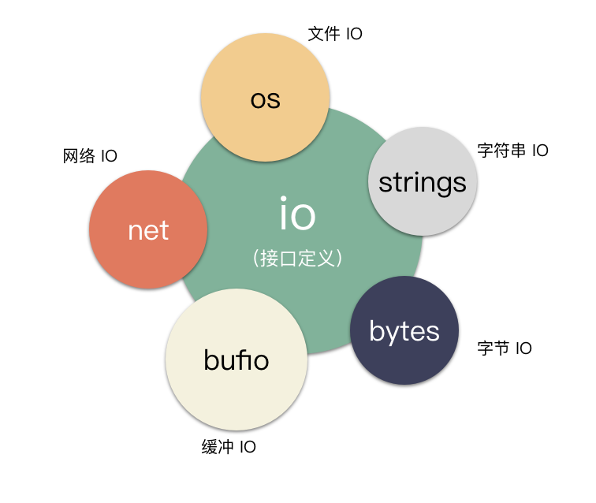
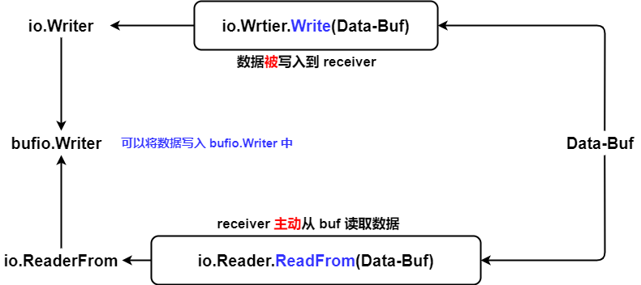

> Reference:
>
> https://medium.com/@matryer/golang-advent-calendar-day-seventeen-io-reader-in-depth-6f744bb4320b
>
> https://colobu.com/2016/10/12/go-file-operations/





注意，接口本身并没有实际作用，而是接口定义的标准 + 其他 package 针对接口的适配实现，让 interface 变得很强，而且通用性很高

另外，因为 interface 具有很强的复用性，而且会在项目中长时间保留，所以 interface 的实现标准、约定一定要明确，interface 的 method 名字也要尽可能精确（当然，也仅仅是一个君子协定，编译器不可能智能到帮你检查实现是不是按照标准来的）

`io package = Reader interface + Writer interrface`


## 常见 interface 语义

### io.Reader

```go
// 最多读 len(p) 的数据，实际读取数据量将会通过 n 返回（0 <= n <= len(p)）
// 注意，是最多读出 len(p) 的数据，而不是 cap(p), 这是因为 Read() 没有返回新 slice 的返回值
// 所以你不能直接 append 诞生一个新的 slice，调用者压根没办法拿到这个 Read() 内部新生成的 slice
// 读到数据就返回，哪怕没有读满 len(p), 毕竟长时间 block 是个大问题
// Read reads up to len(p) bytes into p. It returns the number of bytes
// read (0 <= n <= len(p)) and any error encountered. Even if Read
// returns n < len(p), it may use all of p as scratch space during the call.
// If some data is available but not len(p) bytes, Read conventionally
// returns what is available instead of waiting for more.
//
// When Read encounters an error or end-of-file condition after
// successfully reading n > 0 bytes, it returns the number of
// bytes read. It may return the (non-nil) error from the same call
// or return the error (and n == 0) from a subsequent call.
// An instance of this general case is that a Reader returning
// a non-zero number of bytes at the end of the input stream may
// return either err == EOF or err == nil. The next Read should
// return 0, EOF.
//
// Callers should always process the n > 0 bytes returned before
// considering the error err. Doing so correctly handles I/O errors
// that happen after reading some bytes and also both of the
// allowed EOF behaviors.
//
// Implementations of Read are discouraged from returning a
// zero byte count with a nil error, except when len(p) == 0.
// Callers should treat a return of 0 and nil as indicating that
// nothing happened; in particular it does not indicate EOF.
//
// Implementations must not retain p.
// 具体的 block 与否，取决于实现，而不是被 interface 绑死
type Reader interface {
	Read(p []byte) (n int, err error)
}
```


### io.Writer

```go
// Writer is the interface that wraps the basic Write method.
//
// Write writes len(p) bytes from p to the underlying data stream.
// It returns the number of bytes written from p (0 <= n <= len(p))
// and any error encountered that caused the write to stop early.
// Write must return a non-nil error if it returns n < len(p).
// Write must not modify the slice data, even temporarily.
//
// Implementations must not retain p.
// 约定：
// 如果无法全部写入，那么该方法就一定会返回一个错误。
// Write() 绝对不能对 p 做出任何的改动
type Writer interface {
	Write(p []byte) (n int, err error)
}
```


### io.Copy(dst Writer, src Reader)

> - 当 `dst` 实现了 `io.ReaderFrom`, 能够直接将数据从 `io.Reader` 搬运到自己内部。
>
> - 当 `src` 实现了 `io.WriterTo`, 能够直接将自己的数据搬运到 `io.Writer` 里面去。
>
> 上面两种情况都可以避免不必要的中间拷贝的。
>
> 否则这玩意将会非常慢，因为需要中间额外 copy 了一次数据.

```go
// Copy copies from src to dst until either EOF is reached
// on src or an error occurs. It returns the number of bytes
// copied and the first error encountered while copying, if any.
//
// A successful Copy returns err == nil, not err == EOF.
// Because Copy is defined to read from src until EOF, it does
// not treat an EOF from Read as an error to be reported.
//
// 加速 FAST PATH:
// If src implements the WriterTo interface,
// the copy is implemented by calling src.WriteTo(dst).
// Otherwise, if dst implements the ReaderFrom interface,
// the copy is implemented by calling dst.ReadFrom(src).
func Copy(dst Writer, src Reader) (written int64, err error) {
	return copyBuffer(dst, src, nil)
}


// copyBuffer is the actual implementation of Copy and CopyBuffer.
// if buf is nil, one is allocated.
func copyBuffer(dst Writer, src Reader, buf []byte) (written int64, err error) {
	/* 要是前面这两个 interface 接口断言都失败的话，io.Copy 将会非常慢 */
	// If the reader has a WriteTo method, use it to do the copy.
	// Avoids an allocation and a copy.
	if wt, ok := src.(WriterTo); ok {
		// fast path for src.(io.WriterTo)
		return wt.WriteTo(dst)
	}
	// Similarly, if the writer has a ReadFrom method, use it to do the copy.
	if rt, ok := dst.(ReaderFrom); ok {
		// fast path for dst.(io.ReaderFrom)
		return rt.ReadFrom(src)
	}

	// slow path, 不得不创建临时的中间 buf，避免 write 失败的情况
	if buf == nil {
		size := 32 * 1024
		if l, ok := src.(*LimitedReader); ok && int64(size) > l.N {
			if l.N < 1 {
				size = 1
			} else {
				size = int(l.N)
			}
		}
		buf = make([]byte, size)
	}
	for {
		nr, er := src.Read(buf)
		if nr > 0 {
			nw, ew := dst.Write(buf[0:nr])
			if nw < 0 || nr < nw {
				nw = 0
				if ew == nil {
					ew = errInvalidWrite
				}
			}
			written += int64(nw)
			if ew != nil {
				err = ew
				break
			}
			if nr != nw {
				err = ErrShortWrite
				break
			}
		}
		if er != nil {
			if er != EOF {
				err = er
			}
			break
		}
	}
	return written, err
}
```


### io.ByteReader

> 一个个 byte 读取

```go
// ByteReader is the interface that wraps the ReadByte method.
//
// ReadByte reads and returns the next byte from the input or
// any error encountered. If ReadByte returns an error, no input
// byte was consumed, and the returned byte value is undefined.
//
// ReadByte provides an efficient interface for byte-at-time
// processing. A Reader that does not implement  ByteReader
// can be wrapped using bufio.NewReader to add this method.
type ByteReader interface {
	ReadByte() (byte, error)
}
```


### io.RuneReader

> 一个个 Rune 进行读取

```go
// RuneReader is the interface that wraps the ReadRune method.
//
// ReadRune reads a single UTF-8 encoded Unicode character
// and returns the rune and its size in bytes. If no character is
// available, err will be set.
type RuneReader interface {
   // 返回一个 rune，这个 rune 占用多少 bytes，有没 error
   ReadRune() (r rune, size int, err error)
}
```


### io.ReaderFrom

> receiver 能够将数据从 io.Reader 搬运到到自己内部，具体类型取决于实现
>
> - 一次性全部读取（`bytes.Buffer`）
> - stream 式读取



```go
// ReaderFrom is the interface that wraps the ReadFrom method.
//
// ReadFrom reads data from r until EOF or error.
// The return value n is the number of bytes read.
// Any error except EOF encountered during the read is also returned.
//
// The Copy function uses ReaderFrom if available.
type ReaderFrom interface {
	ReadFrom(r Reader) (n int64, err error)
}
```

- `ReaderFrom.ReadFrom()` 实际上是配合了 `io.Reader` 来用的。因为 `io.Reader` 提供了 `Read()` 的标准 interface，所以 `ReaderFrom.ReadFrom()` 在内部直接通过 `io.Reader.Read()` 来读取数据就好
  - 你可以看看 `bytes.Buffer.ReadFrom()` 的实现示例
- 注意，并没有规定究竟该不该 block，所以具体的行为取决于实现


### io.WriterTo

> 跟 `io.ReaderFrom` 十分类似，是搭配 `io.Writer` 使用的
>
> receiver 能够直接将自己的数据搬运到另一个 `io.Writer`


```go
// WriterTo is the interface that wraps the WriteTo method.
//
// WriteTo writes data to w until there's no more data to write or
// when an error occurs. The return value n is the number of bytes
// written. Any error encountered during the write is also returned.
//
// The Copy function uses WriterTo if available.
type WriterTo interface {
	WriteTo(w Writer) (n int64, err error)
}
```


# 具体实现 package

> - strings package 是为了 string 提供基本操作 API（包括 `io.Reader` 的快速转换）
> - bytes package 是为了 []bytes 提供基本操作 API（包括 `io.Reader` 的快速转换）

## 常见 API 含义

- true or false 的定性判断：
  - `Contains()` 是否包含
  - `ContainsAny()` 两个字符串是否存在任何的交集
  - `HasPrefix()`, `HasSuffix()` 前后缀判断
- 定位查找：
  - `IndexXXXX()` 从前面开始查找；`LastIndexXXXX()` 从后向前查找
- `Equal()` 是区分大小写的比较函数；`EqualFold()` 是不区分大小写的比较函数
- `TrimXXXX()` 修剪原本的数据


## bytes.Buffer

```go
// byte.Buffer 的整个抽象是：我不想管要怎么维护底层 buf 的 size，
// 每次我 Buffer.Write() 总能把全部数据写进去; Buffer.Read() 的时候，总能读出里面的数据，并且自动缩小
// 底层 buf 的维护工作，由 bytes.Buffer 的 method 封装好了

// A Buffer is a variable-sized buffer of bytes with Read and Write methods.
// The zero value for Buffer is an empty buffer ready to use.
// buf[start <---> off <---> len(buf) <---> cap(buf)]
// start    <---> off     : 已经读取过的数据
// off      <---> len(buf): 还没有读取的书数据
// len(buf) <---> cap(buf): 还可以装下多少数据
// 用的时候直接 bytes.Buffer{} 就好，Buffer.buf 在 Write() 的时候，回自动增长的
type Buffer struct {
	buf      []byte // contents are the bytes buf[off : len(buf)]
	off      int    // read at &buf[off], write at &buf[len(buf)]
	lastRead readOp // last read operation, so that Unread* can work correctly.
}


```

- bytes.Buffer 的 `Read()` 跟 `Write()` 都是一个 deep copy 的含义。
  - `bytes.Buffer.Write()` 是将数据拷贝进 Buffer 里面
  - `bytes.Buffer.Read(p)` 是将数据 deep copy 进 `p` 里面，而不是 `bytes.Buffer.buf` 的一个 slice。因为 `bytes.Buffer.buf` 随时可能释放，要是你外面整天拿着 Read 出来的一个内部 slice 不释放，那么就很可能 OOM


### ReadFrom()

> 适合一次性读取全部数据，而不是永不停歇的 stream 读取
>
> 将数据从 `io.Reader` 中搬运到 receiver（也就是 `bytes.Buffer`） 内部

```go
// ReadFrom reads data from r until EOF and appends it to the buffer, growing
// the buffer as needed. The return value n is the number of bytes read. Any
// error except io.EOF encountered during the read is also returned. If the
// buffer becomes too large, ReadFrom will panic with ErrTooLarge.
func (b *Buffer) ReadFrom(r io.Reader) (n int64, err error) {
	b.lastRead = opInvalid
	for {
		i := b.grow(MinRead)
		b.buf = b.buf[:i] // 加长而已
		m, e := r.Read(b.buf[i:cap(b.buf)])
		if m < 0 {
			panic(errNegativeRead)
		}

		b.buf = b.buf[:i+m]
		n += int64(m)
		// 直到 io.EOF 或是出错，才会停下来。否则，永不停歇的读取
		if e == io.EOF {
			return n, nil // e is EOF, so return nil explicitly
		}
		if e != nil {
			return n, e
		}
	}
}
```

- bytes 的 `Buffer.ReadFrom` 是永不停歇的读，所以 stream 式的数据处理实际上并不适合使用。
  - 内部没有锁的，所以也不适合消费者-生产者模型


### WriteTo()

> 将数据直接从 receiver（也就是 `bytes.Buffer`）内部搬运到 `io.Reader` 中

```go
// WriteTo writes data to w until the buffer is drained or an error occurs.
// The return value n is the number of bytes written; it always fits into an
// int, but it is int64 to match the io.WriterTo interface. Any error
// encountered during the write is also returned.
func (b *Buffer) WriteTo(w io.Writer) (n int64, err error) {
	b.lastRead = opInvalid
	if nBytes := b.Len(); nBytes > 0 {
		m, e := w.Write(b.buf[b.off:])
		if m > nBytes {
			panic("bytes.Buffer.WriteTo: invalid Write count")
		}
		b.off += m
		n = int64(m)
		if e != nil {
			return n, e
		}
		// all bytes should have been written, by definition of
		// Write method in io.Writer
		if m != nBytes {
			return n, io.ErrShortWrite
		}
	}
	// Buffer is now empty; reset.
	b.Reset()
	return n, nil
}
```


## bufio

> 针对原始的 io 套一层 buffer，外界可以直接使用 `bufio.Reader` struct, `bufio.Writer` struct。
>
> 看起来更适合 I/O，采用的是类似于环形 buffer 的思路，核心目的是尽可能减少 IO 的次数，每次 IO 尽可能从内核态多拿一些数据出来

- 值得注意的是，bufio package 是应用层的 buf，是在操作系统层之上的！不能把 bufio 直接当成操作系统的 page cache、buffer
- 无论是 `bufio.Reader` 还是 `bufio.Writer` 都是尽可能不改变原有 `Reader`, `Writer` 的 IO 行为的（block、non-block）
  - `bufio.Writer` 通常是通过 `Flush()` 调用底层 `bufio.Writer.wr.Write()` 来完成刷写的。当 buf 装不下这么多数据的时候，而且 `wr` 也没有空间写的话，很可能是发生 block。因为 bufio 不改变底层 IO 的行为，仅仅是作为一层 buffer 减少 IO 的次数。（如果底层 IO 是非阻塞的话，那就不会 block 这个 goroutine，直接返回错误 again）
  - `bufio.Reader` 通常是通过 `fill()` 调用底层 `bufio.Reader.rd.Read()` 来完成读取的。当 buf 里面没有数据，而且 `rd` 也没有数据的话，很可能是 block 的。因为  bufio 不改变底层 IO 的行为，仅仅是作为一个 buffer，尽可能减少 IO 的次数。（如果底层 IO 是非阻塞的话，那就不会 block 这个 goroutine，直接返回错误 again）
  - 至于通常就是在上面的两个地方发生 block，至于究竟会不会发生 block IO，这是取决于 `bufio.Reader.rd.Read()` 跟 `bufio.Writer.wr.Write()` 的。
  - 不会说你 buffer 还有空位，我就一直读，直到 buffer 装满了才返回


- 注意，有了 bufio 之后，并不是说全部 read, write 数据都要先到 buf，才能到底层 IO 的。
  - read：要是 buf 没有数据了，而且 `outBuf` 要一次性拿的数据量，比 `bufio.buf` 还多的时候，那就直接从底层 IO 拿数据，直接放到 `bufio.Read(outBuf)` 的 `outBuf` 里面，不经过 `bufio.buf`，减少 IO 次数。当 Read 出来的数据 `outBuf` 装不下的时候，才暂时缓冲到 `bufio.buf` 里面。
    - 只有当 `outBuf` 比 `bufio.buf` 小的话，那还不如先用 `bufio.buf` 去内核捞数据，这样可以一次性捞更多的数据，减少 IO 次数。
  - write：也是类似的道理。`bufio.buf` 能装下，那就暂时装到 `bufio.buf` 里面，以减少 IO 次数。转不下了，那就直接往内核灌。


### Reader struct

> Reader 是一个数据源，从 Reader 里面读取数据

```go
// 针对 io.Reader 外挂一个 slice 作为 buffer
// NewReader returns a new Reader whose buffer has the default size.
func NewReader(rd io.Reader) *Reader {
    // defaultBufSize = 4 KB
	return NewReaderSize(rd, defaultBufSize)
}

// NewReaderSize returns a new Reader whose buffer has at least the specified
// size. If the argument io.Reader is already a Reader with large enough
// size, it returns the underlying Reader.
func NewReaderSize(rd io.Reader, size int) *Reader {
	// Is it already a Reader?
	b, ok := rd.(*Reader)
	if ok && len(b.buf) >= size {
		return b
	}
	if size < minReadBufferSize {
		size = minReadBufferSize
	}
	r := new(Reader)
	r.reset(make([]byte, size), rd)
	return r
}

// Reader implements buffering for an io.Reader object.
// 针对 io.Reader 外挂一个 slice 作为 buffer
// buf 作为环形缓冲，重复利用
// Reader.buf[start <--> r <--> w <--> len(Reader.buf) <--> cap(Reader.buf)]
// start           <--> r              : 已经读取完毕的数据
// r               <--> w              : 尚未被取走的数据
// w               <--> len(Reader.buf): 还可写入多少数据
// len(Reader.buf) <--> cap(Reader.buf): 还可以扩容收纳多少数据
type Reader struct {
	buf          []byte
	rd           io.Reader // reader provided by the client
	r, w         int       // buf read and write positions
	err          error
	lastByte     int // last byte read for UnreadByte; -1 means invalid
	lastRuneSize int // size of last rune read for UnreadRune; -1 means invalid
}


```

- 作为一个名为 Reader 的 struct，没有必要提供写入数据能力。这也是为何 `bufio.Reader struct` 并没有实现 `io.ReaderFrom interface`，但是实现了 `io.WriterTo interface` 的原因


#### bufio.Reader 什么时候填充 buf 的？

要么是 `bufio.Reader` 被读取的时候，顺便去拉取数据（调用 `bufio.Reader.fill()`  或者是直接去 `io.Reader.Read()` 中读取），读不完的暂时放到 buf 中。buf 的存在，是可以有效减少进入内核态次数的。

但你 bufio 里面囤积太多数据没有读取的话，则不会进入内核态拿新的数据（避免浪费内存）

对于 TCP 而言，内核态囤积太多数据是你 APP 代码写的有问题，或者是系统负载太大了，而不能责怪 bufio package

```go
// fill reads a new chunk into the buffer.
// 要是还有未读取数据就调用 b.fill() 的话，将会引起内存拷贝（理应由程序员根据实际场合选择）
func (b *Reader) fill() {
	// Slide existing data to beginning.
	if b.r > 0 {
		// 整理 b.buf，以便填装更多的数据
		copy(b.buf, b.buf[b.r:b.w])
		b.w -= b.r
		b.r = 0
	}

	if b.w >= len(b.buf) {
		panic("bufio: tried to fill full buffer")
	}

	// Read new data: try a limited number of times.
	for i := maxConsecutiveEmptyReads; i > 0; i-- {
		// 使用底层 Reader 进行 Read，并且暂存在 bufio.buf 里面
		n, err := b.rd.Read(b.buf[b.w:]) // 可能发生 block
		if n < 0 {
			panic(errNegativeRead)
		}
		b.w += n
		if err != nil {
			b.err = err
			return
		}
		if n > 0 {
			return
		}
	}
	b.err = io.ErrNoProgress
}
```


#### bufio.Reader 内存管理

- `bufio.Reader` 倾向于复用 `bufio.buf`，而不是重新申请一块新的 slice，旧的 buffer 让 GC 去回收
- 类似于环形 buffer 的思路

```go
func (b *Reader) Read(p []byte) (n int, err error) {
    ......
    if b.r == b.w {
        ......
        // 内存管理的核心，重新用回 Reader.buf
        b.r = 0
        b.w = 0
        ......
    }

    ......
}
```


#### method: (*b)Read([]byte)

> 从 Reader.buf 里面拉取数据到 `p` 里面

```go
// Read reads data into p.
// It returns the number of bytes read into p.
// The bytes are taken from at most one Read on the underlying Reader,
// hence n may be less than len(p).
// To read exactly len(p) bytes, use io.ReadFull(b, p).
// At EOF, the count will be zero and err will be io.EOF.
func (b *Reader) Read(p []byte) (n int, err error) {
	n = len(p)
	if n == 0 {
		// 容错设计，不影响核心功能
		if b.Buffered() > 0 {
			return 0, nil
		}
		return 0, b.readErr()
	}
	if b.r == b.w {
		// Reader 里面全部的数据都已经被读走了
		// 具体会不会 block 等待，取决于对应 io.Reader 的实现
		// 虽然 io.Reader 约定是不 block 的
		if b.err != nil {
			return 0, b.readErr()
		}
		if len(p) >= len(b.buf) {
			// Large read, empty buffer.
			// Read directly into p to avoid copy. 而且还剩去了 buf grow 的开销
			n, b.err = b.rd.Read(p) // 可能发生 block
			if n < 0 {
				panic(errNegativeRead)
			}
			if n > 0 {
				b.lastByte = int(p[n-1])
				b.lastRuneSize = -1
			}
			return n, b.readErr()
		}
		// 常规一次性读取，io --> bufio
		// One read.
		// Do not use b.fill, which will loop.
		// 内存管理的核心，重新用回 Reader.buf
		// 而不是像 bytes.Buffer 那样让 GC 去回收内存
		b.r = 0
		b.w = 0
		n, b.err = b.rd.Read(b.buf) // 可能发生 block
		if n < 0 {
			panic(errNegativeRead)
		}
		if n == 0 {
			return 0, b.readErr()
		}
		b.w += n
	}
	/*
	else {
	    还有数据没有拿走，不进内核态读新的数据
	    尽可能减少 io 次数
	}
	 */

	// copy as much as we can
	// bufio --> p
	n = copy(p, b.buf[b.r:b.w])
	b.r += n
	b.lastByte = int(b.buf[b.r-1])
	b.lastRuneSize = -1
	return n, nil
}
```


#### method: (*b)ReadSlice(delim byte) (line []byte, err error)

> - 这是一个比较底层的封装，进一步证明了 bufio.Reader 是采用环形缓冲的实现形式；
> - `ReadBytes()`, `ReadString()` 会是比较高级的封装形式
> - `ReadSlice()` 不会发生 copy 行为，而是将底层 Reader.buf 的 slice 暴露给调用者。这时候不能乱动 Reader，不然可能发生数据覆盖。
> - `ReadBytes()`, `ReadString()` 则会发生 copy 行为。单也正因为 copy 了，所以可以继续操作 Reader 而不影响数据

```go
// ReadSlice reads until the first occurrence of delim in the input,
// returning a slice pointing at the bytes in the buffer.
// The bytes stop being valid at the next read.
// 要是在整个 buf 里面都找不到 delim 的话，将会返回 bufio.ErrBufferFull
// bufio.Reader.ReadSlice() 可以再一次读取的，前提是不覆盖未读数据
// If ReadSlice encounters an error before finding a delimiter,
// it returns all the data in the buffer and the error itself (often io.EOF).
// ReadSlice fails with error ErrBufferFull if the buffer fills without a delim.
// Because the data returned from ReadSlice will be overwritten
// by the next I/O operation, most clients should use
// ReadBytes or ReadString instead.
// ReadSlice returns err != nil if and only if line does not end in delim.
func (b *Reader) ReadSlice(delim byte) (line []byte, err error) {
	s := 0 // search start index
	for { // 再次进入这个 for-loop 的前提是：b.buf 后面还可以在填充数据
		// Search buffer.
		if i := bytes.IndexByte(b.buf[b.r+s:b.w], delim); i >= 0 {
			// 成功找到了 delim，返回一个新的切片出去，同时将数据标记为已读
			i += s
			line = b.buf[b.r : b.r+i+1]
			b.r += i + 1
			break
		}

		// Pending error?
		if b.err != nil {
			line = b.buf[b.r:b.w]
			b.r = b.w
			err = b.readErr()
			break
		}

		// Buffer full?
		if b.Buffered() >= len(b.buf) {
			b.r = b.w
			line = b.buf
			err = ErrBufferFull
			break
		}

		s = b.w - b.r // do not rescan area we scanned before

		// 可以再一次读取的，前提是不覆盖未读数据
		// 每次 b.fill() 在没有数据可以读的时候，会比较消耗 CPU
		// 所以 b.fill() 的调用实际应当是上层封装者进行设计的
		b.fill() // buffer is not full
	}

	// Handle last byte, if any. 如果有输出数据的话
	if i := len(line) - 1; i >= 0 {
		b.lastByte = int(line[i])
		b.lastRuneSize = -1
	}

	return
}
```


#### method: (*b)ReadBytes(byte)

> 一直读取数据，直到遇上指定的终止符号


#### method：ReadString(byte)

> 一直读取数据，直到遇上指定的终止符号


### Writer struct

> - 只有当 buf 用完了（万不得已），有大量数据要写入（做一次 IO 性价比足够高）的时候，`bufio.Writer` 才会在内部 method 里面悄咪咪的 `bw.Flush()`
> - `bufio.Writer.Write()` 可能会耗时比较长，尤其是需要写入的数据很多（这时候一般会直接把数据写入 `bufio.Writer.wr` 去）

```go
// NewWriterSize returns a new Writer whose buffer has at least the specified
// size. If the argument io.Writer is already a Writer with large enough
// size, it returns the underlying Writer.
func NewWriterSize(w io.Writer, size int) *Writer {
	// Is it already a Writer?
	b, ok := w.(*Writer)
	if ok && len(b.buf) >= size {
        // 防止套娃
		return b
	}
	if size <= 0 {
		size = defaultBufSize
	}
	return &Writer{
		buf: make([]byte, size),
		wr:  w,
	}
}

// NewWriter returns a new Writer whose buffer has the default size.
func NewWriter(w io.Writer) *Writer {
	return NewWriterSize(w, defaultBufSize)
}

// Writer implements buffering for an io.Writer object.
// If an error occurs writing to a Writer, no more data will be
// accepted and all subsequent writes, and Flush, will return the error.
// 出错了之后，你应当检查完数据之后，再考虑时候能够重新写入
// After all data has been written, the client should call the
// Flush method to guarantee all data has been forwarded to
// the underlying io.Writer.
// 0 <---> n 已经被 Writer 缓存起来的数据结尾，但是还没有向 io 写入
// n <---> len(buf) 是还没有被使用的 buf 空间
type Writer struct {
	err error
	buf []byte
	n   int
	wr  io.Writer
}
```


#### method: (*b)Write([]byte)

> 调用完之后，很可能仅仅将数据暂存在 buf 里面，而没有 flush 进 io.Writer 里面，所以必要时是要自己手动 `bufio.Writer.Flush()`

```go
// Write writes the contents of p into the buffer.
// It returns the number of bytes written.
// If nn < len(p), it also returns an error explaining
// why the write is short.
func (b *Writer) Write(p []byte) (nn int, err error) {
	for len(p) > b.Available() && b.err == nil {
		// case-1: 针对大量数据待 wirte 或 case-2: bufio.Writer.buf 已经没有多少 buffer 空间 时：
		// Writer 根本装不完要写入的数据，那就直接向 bufio.Writer.wr 写入数据
		// bufio 的核心是减少 IO 操作的次数。既然数据都多到 bufio.Writer.buf 装不下了，
		// 那么直接来一次 b.wr.Write(p) 也是相当实惠的一件事，必然是性价比很高的 IO 写入操作
		var n int
		if b.Buffered() == 0 {
			// Large write, empty buffer.
			// Write directly from p to avoid copy.
			n, b.err = b.wr.Write(p) // 可能发生 block
		} else {
			// 可能是 case-2: bufio.Writer.buf 已经没有多少 buffer 空间
			n = copy(b.buf[b.n:], p)
			b.n += n
			b.Flush() // 尽可能多 flush 一些数据
		}
		nn += n
		p = p[n:] // 收缩，还剩下这么多数据没有 write
	}
	if b.err != nil {
		return nn, b.err
	}

	// 只有少量数据需要 write 时：
	// 显然是暂缓 flush 更为实惠。可以等待 buf 满了之后再 flush，或者是再外面手动调用 bufio.Writer.Flush()
	n := copy(b.buf[b.n:], p)
	b.n += n
	nn += n
	return nn, nil
}
```


#### method: (*b)Flush()

> 说白了就是调用底层的 `bufio.Writer.wr.Write(bufio.Writer.buf)`

```go
// Flush writes any buffered data to the underlying io.Writer.
// 说白了就是调用底层的 bufio.Writer.wr.Write(bufio.Writer.buf)
func (b *Writer) Flush() error {
	if b.err != nil {
		return b.err
	}
	if b.n == 0 {
		return nil
	}
	n, err := b.wr.Write(b.buf[0:b.n]) // 可能发生 block
	if n < b.n && err == nil {
		err = io.ErrShortWrite
	}
	if err != nil {
		if n > 0 && n < b.n {
			// 因为特殊情况，只有部分数据成功写入
			// 所以只能 copy 一下了
			copy(b.buf[0:b.n-n], b.buf[n:b.n])
		}
		b.n -= n
		b.err = err
		return err
	}

	// 正常情况下，bufio.Writer.buf 的数据都能写进去的
	b.n = 0 // reset bufio.Writer.buf 重复利用
	return nil
}
```


