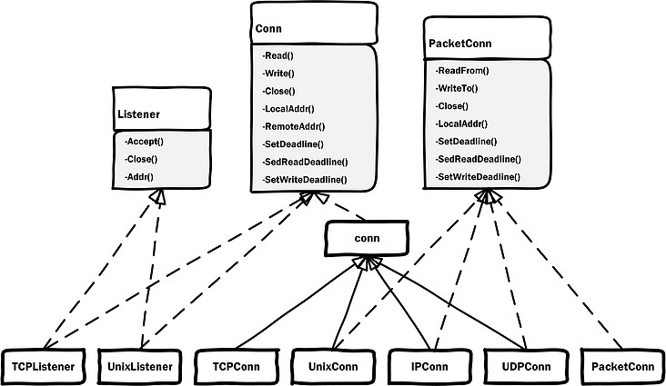
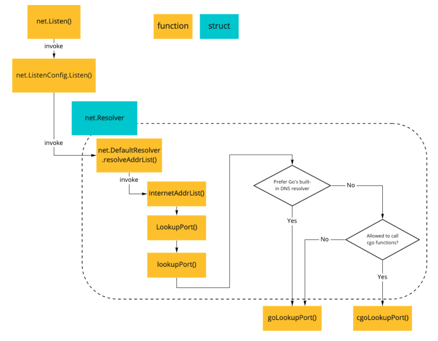
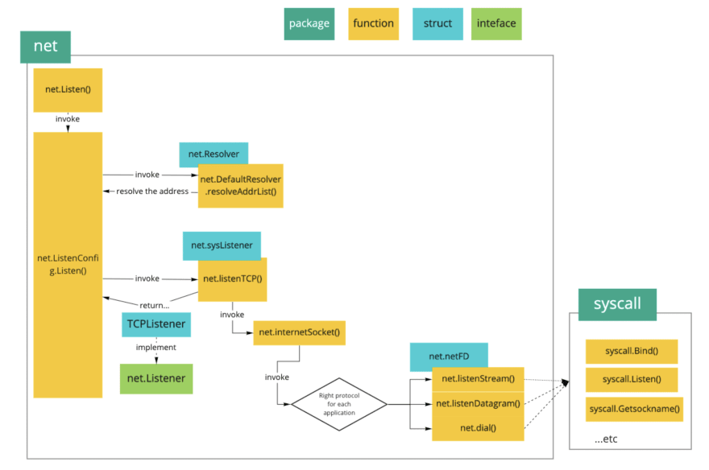
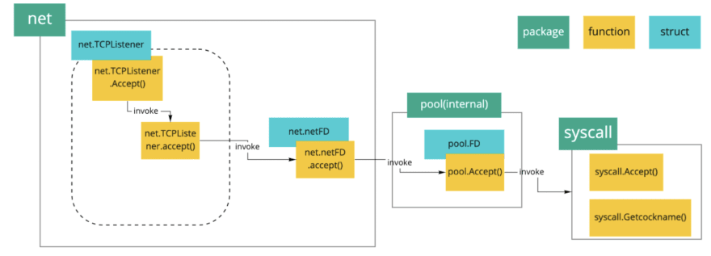

****




# TODO

> https://colobu.com/2019/02/23/1m-go-tcp-connection/


# net package

## Reference

> https://colobu.com/2019/02/23/1m-go-tcp-connection/
>
> https://tonybai.com/2015/11/17/tcp-programming-in-golang/
>
> https://tonybai.com/2021/07/28/classic-blocking-network-tcp-stream-protocol-parsing-practice-in-go/


## demo

### TCP echo server

```go
package main

import (
	"log"
	"fmt"
	"bufio"
	"net"
)

const proto = "tcp"
const ipAddr = "localhost:25000"

const buffSize = 256

func main() {
	/* Listen TCP in localhost:2000 */
	proto := "tcp"

	l, err := net.Listen(proto, ipAddr)
	if err != nil {
		log.Fatal(err)
	}
	defer l.Close()
	fmt.Printf("====== Server Listen %s on %s ======\n", proto, ipAddr)

	/* do echo and close */
	for {
		conn, err := l.Accept()
		if err != nil {
			log.Fatal(err)
		}

		info := fmt.Sprintf("[%s --> %s]", conn.LocalAddr().String(), conn.RemoteAddr().String())
		fmt.Printf("new connection: %s\n", info)
		// go handleTcpEcho(conn)
		go handleTcpClient(conn)
	}
}

// perform only one Echo action for per TCP connection
func handleTcpEchoOnce(c net.Conn) {
	info := fmt.Sprintf("[%s --> %s]", c.LocalAddr().String(), c.RemoteAddr().String())

	/* read data */
	buff := make([]byte, buffSize)
	nr, err := c.Read(buff)
	if err != nil {
		fmt.Println("come across error:", err)
	}

	/* write back */
	nw, _ := c.Write(buff[:nr]) // do echo
	fmt.Printf("%s: %s", info, string(buff))

	// Shut down the connection.
	c.Close()
	fmt.Printf("%s: read %d bytes, write %d bytes. close and exit\n", info, nr, nw)
}

// perform echo until TCP connect close
func handleTcpClient(c net.Conn) {
	info := fmt.Sprintf("[%s --> %s]", c.LocalAddr().String(), c.RemoteAddr().String())
	reader := bufio.NewReader(c)
	totalRead, totalWrite := 0, 0
	for {
		/* read data */
		line, err := reader.ReadBytes('\n')
		if err != nil {
			fmt.Println("come across error:", err)
			break
		}
		totalRead += len(line)

		/* echo back */
		nw, _ := c.Write(line) // do echo
		fmt.Printf("%s: %s", info, string(line))
		totalWrite += nw
	}

	c.Close()
	fmt.Printf("%s: read %d bytes, write %d bytes. close and exit\n", info, totalRead, totalWrite)
}
```


```go
/* demo for TCP client */
telnet localhost 25000
```


## Reference

> https://dev.to/hgsgtk/how-go-handles-network-and-system-calls-when-tcp-server-1nbd


## interface

### net.Conn

- 就 TCP 而言，net package 不应该为 `net.TCPConn` 裹上一层 buf。因为 TCP 本身就是 stream 式的协议，应用怎么解决粘包问题，是调用者的事。所以标准库在不知道分割标准的前提下，直接为 `net.TCPConn` 裹上一层 buf，实在是不合适
  - 显然，HTTP 不一样。HTTP 已经有了标准的应用层包分割的标准，所以直接在标准库内部裹上 buf，分包也是可以的。甚至是对使用者更友好的

```go
// Conn is a generic stream-oriented network connection.

//
// Multiple goroutines may invoke methods on a Conn simultaneously.
type Conn interface {
	// Read reads data from the connection.
	// Read can be made to time out and return an error after a fixed
	// time limit; see SetDeadline and SetReadDeadline.
	Read(b []byte) (n int, err error)

	// Write writes data to the connection.
	// Write can be made to time out and return an error after a fixed
	// time limit; see SetDeadline and SetWriteDeadline.
	Write(b []byte) (n int, err error)

	// Close closes the connection.
	// Any blocked Read or Write operations will be unblocked and return errors.
	Close() error

	// LocalAddr returns the local network address.
	LocalAddr() Addr

	// RemoteAddr returns the remote network address.
	RemoteAddr() Addr

	// SetDeadline sets the read and write deadlines associated
	// with the connection. It is equivalent to calling both
	// SetReadDeadline and SetWriteDeadline.
	//
	// A deadline is an absolute time after which I/O operations
	// fail instead of blocking. The deadline applies to all future
	// and pending I/O, not just the immediately following call to
	// Read or Write. After a deadline has been exceeded, the
	// connection can be refreshed by setting a deadline in the future.
	//
	// If the deadline is exceeded a call to Read or Write or to other
	// I/O methods will return an error that wraps os.ErrDeadlineExceeded.
	// This can be tested using errors.Is(err, os.ErrDeadlineExceeded).
	// The error's Timeout method will return true, but note that there
	// are other possible errors for which the Timeout method will
	// return true even if the deadline has not been exceeded.
	//
	// An idle timeout can be implemented by repeatedly extending
	// the deadline after successful Read or Write calls.
	//
	// A zero value for t means I/O operations will not time out.
	SetDeadline(t time.Time) error

	// SetReadDeadline sets the deadline for future Read calls
	// and any currently-blocked Read call.
	// A zero value for t means Read will not time out.
	SetReadDeadline(t time.Time) error

	// SetWriteDeadline sets the deadline for future Write calls
	// and any currently-blocked Write call.
	// Even if write times out, it may return n > 0, indicating that
	// some of the data was successfully written.
	// A zero value for t means Write will not time out.
	SetWriteDeadline(t time.Time) error
}

```


#### net.TCPConn

```go
// TCPConn is an implementation of the Conn interface for TCP network
// connections.
type TCPConn struct {
    // embeded 的方式直接继承 net.conn 的 Read() + Write()
	conn
}

type conn struct {
	fd *netFD
}

// 将 netFD 封装为 TCPConn
func newTCPConn(fd *netFD) *TCPConn {
	c := &TCPConn{conn{fd}}
	setNoDelay(c.fd, true) // 默认立马发包出去
	return c
}
```


**读写能力**

- 显然 `net.TCPConn` 是具有 socket read\write 能力的，==是比较原始的裸 IO，不包含 buffer==


`io.Reader`, `io.Writer`

- 直接继承 `net.conn` 的 `Write()` 跟 `Read()`

```bash
> net.(*TCPConn).Write() <autogenerated>:1 (hits goroutine(23):3 total:3) (PC: 0x4c76a6)
Warning: debugging optimized function
(dlv) s
> net.(*conn).Write() /usr/local/go/src/net/net.go:191 (PC: 0x4bb4ea)
Warning: debugging optimized function
   186:		}
   187:		return n, err
   188:	}
   189:	
   190:	// Write implements the Conn Write method.
// 继承的是 conn 的 Write()
=> 191:	func (c *conn) Write(b []byte) (int, error) {
   192:		if !c.ok() {
   193:			return 0, syscall.EINVAL
   194:		}
   195:		n, err := c.fd.Write(b)
   196:		if err != nil {
(dlv) bp
Breakpoint runtime-fatal-throw (enabled) at 0x433040 for runtime.throw() /usr/local/go/src/runtime/panic.go:1188 (0)
Breakpoint unrecovered-panic (enabled) at 0x4333a0 for runtime.fatalpanic() /usr/local/go/src/runtime/panic.go:1271 (0)
	print runtime.curg._panic.arg
Breakpoint 1 (enabled) at 0x4c76a6 for net.(*TCPConn).Write() <autogenerated>:1 (3)
(dlv) bt
0  0x00000000004bb4ea in net.(*conn).Write
   at /usr/local/go/src/net/net.go:191
1  0x00000000004c76ce in net.(*TCPConn).Write
   at <autogenerated>:1
2  0x00000000004c9e18 in main.handleTcpClient
   at ./main.go:75
3  0x00000000004c9814 in main.main·dwrap·2
   at ./main.go:36
4  0x0000000000460c41 in runtime.goexit
   at /usr/local/go/src/runtime/asm_amd64.s:1581
```


```go
>> net/net.go:
// Read implements the Conn Read method.
func (c *conn) Read(b []byte) (int, error) {
	if !c.ok() {
		return 0, syscall.EINVAL
	}
	n, err := c.fd.Read(b)
	if err != nil && err != io.EOF {
		err = &OpError{Op: "read", Net: c.fd.net, Source: c.fd.laddr, Addr: c.fd.raddr, Err: err}
	}
	return n, err
}

>> net/fd_posix.go:
func (fd *netFD) Read(p []byte) (n int, err error) {
	n, err = fd.pfd.Read(p)
	runtime.KeepAlive(fd)
	return n, wrapSyscallError(readSyscallName, err)
}

>> src/internal/poll/fd_unix.go:
// Read implements io.Reader.
func (fd *FD) Read(p []byte) (int, error) {
        ....
        for {
         	   // 实际上就是 syscall.Read(fd.Sysfd, p)
                n, err := ignoringEINTRIO(syscall.Read, fd.Sysfd, p)
                if err != nil {
                        n = 0
                        if err == syscall.EAGAIN && fd.pd.pollable() {
                        // 实际上设置的是非阻塞 IO，但是对于 goroutine 表现为阻塞 IO
                                if err = fd.pd.waitRead(fd.isFile); err == nil {
                                        // 本 goroutine 正式开始读取数据
                                        continue
                                }
                        }
                }
                // 成功读取数据，返回
                err = fd.eofError(n, err)
                return n, err
        }
}

>>  src/internal/poll/fd_poll_runtime.go:
// block 住这个 goroutine
func (pd *pollDesc) wait(mode int, isFile bool) error {
        if pd.runtimeCtx == 0 {
                return errors.New("waiting for unsupported file type")
        }
        res := runtime_pollWait(pd.runtimeCtx, mode)
        return convertErr(res, isFile)
}

>> src/runtime/netpoll.go:
// poll_runtime_pollWait, which is internal/poll.runtime_pollWait,
// waits for a descriptor to be ready for reading or writing,
// according to mode, which is 'r' or 'w'.
// This returns an error code; the codes are defined above.
//go:linkname poll_runtime_pollWait internal/poll.runtime_pollWait
func poll_runtime_pollWait(pd *pollDesc, mode int) int {
        errcode := netpollcheckerr(pd, int32(mode))
        if errcode != pollNoError {
                return errcode
        }
        // As for now only Solaris, illumos, and AIX use level-triggered IO.
        if GOOS == "solaris" || GOOS == "illumos" || GOOS == "aix" {
                netpollarm(pd, mode)
        }
        for !netpollblock(pd, int32(mode), false) {
                errcode = netpollcheckerr(pd, int32(mode))
                if errcode != pollNoError {
                        return errcode
                }
                // Can happen if timeout has fired and unblocked us,
                // but before we had a chance to run, timeout has been reset.
                // Pretend it has not happened and retry.
        }
        return pollNoError
}

>> src/runtime/netpoll.go:
// returns true if IO is ready, or false if timedout or closed
// waitio - wait only for completed IO, ignore errors
// Concurrent calls to netpollblock in the same mode are forbidden, as pollDesc
// can hold only a single waiting goroutine for each mode.
func netpollblock(pd *pollDesc, mode int32, waitio bool) bool {
		.......
        // need to recheck error states after setting gpp to pdWait
        // this is necessary because runtime_pollUnblock/runtime_pollSetDeadline/deadlineimpl
        // do the opposite: store to closing/rd/wd, membarrier, load of rg/wg
        if waitio || netpollcheckerr(pd, mode) == 0 {
            	// 看，就在这里，把 goroutine park 掉
                gopark(netpollblockcommit, unsafe.Pointer(gpp), waitReasonIOWait, traceEvGoBlockNet, 5)
        }
		......
}

//===========================================================
>> net/net.go:
// Write implements the Conn Write method.
func (c *conn) Write(b []byte) (int, error) {
	if !c.ok() {
		return 0, syscall.EINVAL
	}
	n, err := c.fd.Write(b)
	if err != nil {
		err = &OpError{Op: "write", Net: c.fd.net, Source: c.fd.laddr, Addr: c.fd.raddr, Err: err}
	}
	return n, err
}

>> net/fd_posix.go:
func (fd *netFD) Write(p []byte) (nn int, err error) {
    // 跟 Read 基本同理，读不到的话，就 park 掉 goroutine
	nn, err = fd.pfd.Write(p)
	runtime.KeepAlive(fd)
	return nn, wrapSyscallError(writeSyscallName, err)
}
```


`io.ReaderFrom`

```go
// ReadFrom implements the io.ReaderFrom ReadFrom method.
func (c *TCPConn) ReadFrom(r io.Reader) (int64, error) {
	if !c.ok() {
		return 0, syscall.EINVAL
	}
	n, err := c.readFrom(r)
	if err != nil && err != io.EOF {
		err = &OpError{Op: "readfrom", Net: c.fd.net, Source: c.fd.laddr, Addr: c.fd.raddr, Err: err}
	}
	return n, err
}
```


### net.Addr

- 这是一个很好的抽象，统合了 tcp、udp、unix 的多种情况
- 因为一个网络地址，其实就是 `socket 种类 + 三层协议种类 + 三层地址选择 + 四层协议种类 + 四层端口选择`

```go
// Addr represents a network end point address.
//
// The two methods Network and String conventionally return strings
// that can be passed as the arguments to Dial, but the exact form
// and meaning of the strings is up to the implementation.
type Addr interface {
	Network() string // name of the network (for example, "tcp", "udp")
	String() string  // string form of address (for example, "192.0.2.1:25", "[2001:db8::1]:80")
}
```


#### net.IP

```go
// An IP is a single IP address, a slice of bytes.
// Functions in this package accept either 4-byte (IPv4)
// or 16-byte (IPv6) slices as input.
//
// Note that in this documentation, referring to an
// IP address as an IPv4 address or an IPv6 address
// is a semantic property of the address, not just the
// length of the byte slice: a 16-byte slice can still
// be an IPv4 address.
// 并不属于 net.Addr interface, 因为 net.Addr 还包括的四层协议种类的信息
// 单纯的 IP 并不包括四层信息
// 但是 net.IP 是 net.TCPAddr, net.UDPAddr 的成员之一
type IP []byte
```


#### net.TCPAddr

```go
// TCPAddr represents the address of a TCP end point.
type TCPAddr struct {
	IP   IP
	Port int
	Zone string // IPv6 scoped addressing zone
}

// Network returns the address's network name, "tcp".
func (a *TCPAddr) Network() string { return "tcp" }

func (a *TCPAddr) String() string {
	if a == nil {
		return "<nil>"
	}
	ip := ipEmptyString(a.IP)
	if a.Zone != "" {
		return JoinHostPort(ip+"%"+a.Zone, itoa.Itoa(a.Port))
	}
	return JoinHostPort(ip, itoa.Itoa(a.Port))
}
```


#### net.UDPAddr

```go
// UDPAddr represents the address of a UDP end point.
type UDPAddr struct {
	IP   IP
	Port int
	Zone string // IPv6 scoped addressing zone
}

// Network returns the address's network name, "udp".
func (a *UDPAddr) Network() string { return "udp" }

func (a *UDPAddr) String() string {
	if a == nil {
		return "<nil>"
	}
	ip := ipEmptyString(a.IP)
	if a.Zone != "" {
		return JoinHostPort(ip+"%"+a.Zone, itoa.Itoa(a.Port))
	}
	return JoinHostPort(ip, itoa.Itoa(a.Port))
}
```


### net.Listener

- 作为一个 `net.Listener` 核心的功能是：知道自己监听什么端口，能够 `close()`, `accept()`, 所以也就有了下面的抽象。至于怎么实例化、配置这个具体的 `net.Listener` 实例，那是 struct 要考虑的事情，而不是 interface

```go
// A Listener is a generic network listener for stream-oriented protocols.
//
// Multiple goroutines may invoke methods on a Listener simultaneously.
// call flow:
// 1. 创建一个实现了 net.Listener interface 的实例（比如：net.sysListener struct）
// 2. 自己完成：创建 socket、bind、listen 的工作
// 3. 开始调用 net.Listener.Accept() 等待连接进来
/**
 * 为什么不把 bind、listen 也抽象出来呢？
 * 首先 net.Listener 是 a generic network listener for stream-oriented protocols
 * bind 不 bind 嘛，看情况而定。但是 Accept() 是必然的。Golang 追求的是小 interface
 * 所以你是可以在 net.Listener interface 的基础上，在套一层含有 bind、listen 的 interface
 * 但是你这个 wrapper 就已经很具体了，没啥通用性，那还不如扔进 struct 里面，而不是 interface
 */
type Listener interface {
	// Accept waits for and returns the next connection to the listener.
	Accept() (Conn, error)

	// Close closes the listener.
	// Any blocked Accept operations will be unblocked and return errors.
	Close() error

	// Addr returns the listener's network address.
	Addr() Addr
}
```


#### net.TCPListener

```go
// TCPListener is a TCP network listener. Clients should typically
// use variables of type Listener instead of assuming TCP.
type TCPListener struct {
	fd *netFD
	lc ListenConfig
}

// Accept implements the Accept method in the Listener interface; it
// waits for the next call and returns a generic Conn.
// 实际上底层依然是调用 net.TCPListener.fd.accept()
func (l *TCPListener) Accept() (Conn, error) {
	if !l.ok() {
		return nil, syscall.EINVAL
	}
	c, err := l.accept()
	if err != nil {
		return nil, &OpError{Op: "accept", Net: l.fd.net, Source: nil, Addr: l.fd.laddr, Err: err}
	}
	return c, nil
}

func (ln *TCPListener) accept() (*TCPConn, error) {
	fd, err := ln.fd.accept()
	if err != nil {
		return nil, err
	}
	tc := newTCPConn(fd)
	if ln.lc.KeepAlive >= 0 {
		setKeepAlive(fd, true)
		ka := ln.lc.KeepAlive
		if ln.lc.KeepAlive == 0 {
			ka = defaultTCPKeepAlive
		}
		setKeepAlivePeriod(fd, ka)
	}
	return tc, nil
}
```


## function


## net 与底层 socket

### 初始化监听 socket

> 调用 `tcpListener := net.Listen("tcp", "localhost:8888")`
>
> 核心目的：
>
> 1. 设置监听的协议类型
> 2. 设置监听的端口
> 3. 设置监听的地址
> 4. 根据配置，创建监听的 socket



<center>IP:Port 解析过程</center>



<center>TCP server 过程</center>

```go
net/dial.go:
func Listen(network, address string) (Listener, error) {
        var lc ListenConfig
        // 使用默认的 ListenConfig, 内置 DNS 解析器
        return lc.Listen(context.Background(), network, address)
}

func (lc *ListenConfig) Listen(ctx context.Context, network, address string) (Listener, error) {
		// 解析 DNS、协议种类、端口
        addrs, err := DefaultResolver.resolveAddrList(ctx, "listen", network, address, nil)

        sl := &sysListener{
                ListenConfig: *lc,
                network:      network,
                address:      address,
        }
        var l Listener
        la := addrs.first(isIPv4) // 执行 isIPv4() 的检查，找出第一个满足条件的地址
        switch la := la.(type) {
        case *TCPAddr:
			   // 绑定、监听响应的地址
                // 创建一个 TCP 的 socket，并 bind、listen
                l, err = sl.listenTCP(ctx, la)
		......
        }

        return l, nil
}

net/tcpsock_posix.go:
func (sl *sysListener) listenTCP(ctx context.Context, laddr *TCPAddr) (*TCPListener, error) {
		// 创建 SOCK_STREAM 类型的 socket
        fd, err := internetSocket(ctx, sl.network, laddr, nil, syscall.SOCK_STREAM, 0, "listen", sl.ListenConfig.Control)
        if err != nil {
                return nil, err
        }

		// wrap listen socket fd as a TCPListener
        return &TCPListener{fd: fd, lc: sl.ListenConfig}, nil
}

net/ipsock_posix.go:
func internetSocket(ctx context.Context, net string, laddr, raddr sockaddr, sotype, proto int, mode string, ctrlFn func(string, string, syscall.RawConn) error) (fd *netFD, err error) {
        if (runtime.GOOS == "aix" || runtime.GOOS == "windows" || runtime.GOOS == "openbsd") && mode == "dial" && raddr.isWildcard() {
                raddr = raddr.toLocal(net)
        }
        family, ipv6only := favoriteAddrFamily(net, laddr, raddr, mode)
        return socket(ctx, net, family, sotype, proto, ipv6only, laddr, raddr, ctrlFn)
}

net/sock_posix.go:
// socket returns a network file descriptor that is ready for
// asynchronous I/O using the network poller.
func socket(ctx context.Context, net string, family, sotype, proto int, ipv6only bool, laddr, raddr sockaddr, ctrlFn func(string, string, syscall.RawConn) error) (fd *netFD, err error) {
        // 1. centos 7 的话，会走 src/net/sock_cloexec.go:sysSocket()
        // 2. 再走 hook_unix.go:syscall.Socket()
        // TCP 的话，family = 2 (syscall.AF_INET), proto = 0, sotype = 1 (syscall.SOCK_STREAM)
        s, err := sysSocket(family, sotype, proto)
        if err != nil {
                return nil, err
        }
	    .........
        // 封装原始 fd
        if fd, err = newFD(s, family, sotype, net); err != nil {
                poll.CloseFunc(s)
                return nil, err
        }

        // This function makes a network file descriptor for the
        // following applications:
        //
        // - An endpoint holder that opens a passive stream
        //   connection, known as a stream listener
        if laddr != nil && raddr == nil {
                switch sotype {
                case syscall.SOCK_STREAM, syscall.SOCK_SEQPACKET:
                        if err := fd.listenStream(laddr, listenerBacklog(), ctrlFn); err != nil {
                                fd.Close()
                                return nil, err
                        }
                        return fd, nil
                case syscall.SOCK_DGRAM:
					..........
                }
        }
    	.....
        // dailer 相关的
        return fd, nil
}

net/sock_cloexec.go:
func sysSocket(family, sotype, proto int) (int, error) {
		// SOCK_NONBLOCK: 看，虽然 read、write 的时候，是 block，但实际设置的确实非阻塞
        /* SOCK_CLOEXEC(close on exec() call): 
         * Note that the use of this flag is essential in some multithreaded programs.
         * 这个 fd 我在 fork 子进程后执行 exec() 时就关闭，避免父进程重启后，无法再次监听这个端口（因为子进程占用着）
         * 这就意味着，这个 socket fd 是不能被子进程继承的。
         * 既可以是是避免 fd leak，也可以是权限控制，避免高权限进程 open 的 fd，被低权限的子进程使用
         */
        s, err := socketFunc(family, sotype|syscall.SOCK_NONBLOCK|syscall.SOCK_CLOEXEC, proto)

        switch err {
        case nil:
                // 通常这里就会正常返回了
                return s, nil
        default:
                return -1, os.NewSyscallError("socket", err)
        case syscall.EPROTONOSUPPORT, syscall.EINVAL:
            // 兼容不支持 SOCK_NONBLOCK、SOCK_CLOEXEC 旧版本系统
            // If we get an EINVAL error on Linux
            // or EPROTONOSUPPORT error on FreeBSD, fall back to using
            // socket without them.
        }
	    .........
}

// net fd 相关
net/fd_posix.go:
// Network file descriptor.
type netFD struct {
	pfd poll.FD

	// immutable until Close
	family      int
	sotype      int
	isConnected bool // handshake completed or use of association with peer
	net         string
	laddr       Addr
	raddr       Addr
}

net/fd_unix.go:
func newFD(sysfd, family, sotype int, net string) (*netFD, error) {
	ret := &netFD{
		pfd: poll.FD{
			Sysfd:         sysfd,
			IsStream:      sotype == syscall.SOCK_STREAM,
			ZeroReadIsEOF: sotype != syscall.SOCK_DGRAM && sotype != syscall.SOCK_RAW,
		},
		family: family,
		sotype: sotype,
		net:    net,
	}
	return ret, nil
}

// 完成 bind + listen
net/sock_posix.go:
func (fd *netFD) listenStream(laddr sockaddr, backlog int, ctrlFn func(string, string, syscall.RawConn) error) error {
	var err error
	if err = setDefaultListenerSockopts(fd.pfd.Sysfd); err != nil {
		return err
	}
	var lsa syscall.Sockaddr
	if lsa, err = laddr.sockaddr(fd.family); err != nil {
		return err
	}
	if ctrlFn != nil {
		c, err := newRawConn(fd)
		if err != nil {
			return err
		}
		if err := ctrlFn(fd.ctrlNetwork(), laddr.String(), c); err != nil {
			return err
		}
	}
	if err = syscall.Bind(fd.pfd.Sysfd, lsa); err != nil {
		return os.NewSyscallError("bind", err)
	}
	if err = listenFunc(fd.pfd.Sysfd, backlog); err != nil {
		return os.NewSyscallError("listen", err)
	}
	if err = fd.init(); err != nil {
		return err
	}
	lsa, _ = syscall.Getsockname(fd.pfd.Sysfd)
	fd.setAddr(fd.addrFunc()(lsa), nil)
	return nil
}
```


### 监听 socket 开始 accept TCP 链接

> 调用 `conn, err := net.Listener.Accept()`
>
> 目的：block 等待 TCP 连接的到来



<center>Accept 过程</center>

- 总体来说没什么特别，就是对原始的系统调用封装而已，返回一个 `net.Conn` interface, 底层是 `net.TCPConn` struct

```go
应为 listener 是个 interface，在 TCP 的 case 中，那就是 *TCPListener struct

net/tcpsock.go:
type TCPListener struct {
	fd *netFD
	lc ListenConfig
}

// Accept implements the Accept method in the Listener interface; it
// waits for the next call and returns a generic Conn.
func (l *TCPListener) Accept() (Conn, error) {
	if !l.ok() {
		return nil, syscall.EINVAL
	}
	c, err := l.accept()
	if err != nil {
		return nil, &OpError{Op: "accept", Net: l.fd.net, Source: nil, Addr: l.fd.laddr, Err: err}
	}
	return c, nil
}

net/tcpsock_posix.go:
func (ln *TCPListener) accept() (*TCPConn, error) {
	fd, err := ln.fd.accept()
	if err != nil {
		return nil, err
	}
	tc := newTCPConn(fd)
	if ln.lc.KeepAlive >= 0 {
		setKeepAlive(fd, true)
		ka := ln.lc.KeepAlive
		if ln.lc.KeepAlive == 0 {
			ka = defaultTCPKeepAlive
		}
		setKeepAlivePeriod(fd, ka)
	}
	return tc, nil
}

net/fd_unix.go:
func (fd *netFD) accept() (netfd *netFD, err error) {
	d, rsa, errcall, err := fd.pfd.Accept()
	if err != nil {
		if errcall != "" {
			err = wrapSyscallError(errcall, err)
		}
		return nil, err
	}

    // 裹上 netFD 的封装
	if netfd, err = newFD(d, fd.family, fd.sotype, fd.net); err != nil {
		poll.CloseFunc(d)
		return nil, err
	}
	if err = netfd.init(); err != nil {
		netfd.Close()
		return nil, err
	}
    
    // 填充底层 socket 信息
	lsa, _ := syscall.Getsockname(netfd.pfd.Sysfd)
	netfd.setAddr(netfd.addrFunc()(lsa), netfd.addrFunc()(rsa))
	return netfd, nil
}

// fd 相关
internal/poll/fd_unix.go:
// Accept wraps the accept network call.
func (fd *FD) Accept() (int, syscall.Sockaddr, string, error) {
	if err := fd.readLock(); err != nil {
		return -1, nil, "", err
	}
	defer fd.readUnlock()

	if err := fd.pd.prepareRead(fd.isFile); err != nil {
		return -1, nil, "", err
	}
	for {
		s, rsa, errcall, err := accept(fd.Sysfd)
		if err == nil {
			return s, rsa, "", err
		}
		switch err {
		case syscall.EINTR:
			continue
		case syscall.EAGAIN:
			if fd.pd.pollable() {
				if err = fd.pd.waitRead(fd.isFile); err == nil {
					continue
				}
			}
		case syscall.ECONNABORTED:
			// This means that a socket on the listen
			// queue was closed before we Accept()ed it;
			// it's a silly error, so try again.
			continue
		}
		return -1, nil, errcall, err
	}
}

```


# net/http package

## Reference

> 


- http server in net/http package = 路由表(转发规则) + TCP-server + HTTP 协议解析 + 业务 handler


## demo

### HTTP server

```go
package main

import (
	"fmt"
	"io"
	"io/ioutil"
	"net/http"
)

// http 本身就是要求无状态，所以不暴露太多信息给每一个 handler，合情合理
// 直接注入 function 还是比较像面向过程的方案
func helloHandler(w http.ResponseWriter, r *http.Request) {
	fmt.Printf("[%s]==> helloHandler visit %s\n", r.RemoteAddr, r.URL.Path)
	io.WriteString(w, "Hello, world!\n")
}

func echoHandler(w http.ResponseWriter, r *http.Request) {
	fmt.Printf("[%s]==> echoHandler visit %s\n", r.RemoteAddr, r.URL.Path)
	io.WriteString(w, r.URL.Path + "\n")
}

func helperHandler(w http.ResponseWriter, r *http.Request) {
	fmt.Printf("[%s]==> helperHandler visit %s\n", r.RemoteAddr, r.URL.Path)
	io.WriteString(w, r.URL.Path + "\n")
}

func headerControlHandler(w http.ResponseWriter, r *http.Request) {
	fmt.Printf("[%s]==> headerControlHandler visit %s\n", r.RemoteAddr, r.URL.Path)
	
	/* set HTTP Header */
	w.Header().Set("Allow", http.MethodPost) // Header.Set() 只会设置一个 Allow Header
	
	w.Header().Add("Cache-Control", "public") // 设置多个 Cache-Control Header
	w.Header().Add("Cache-Control", "max-age=31536000")
	
	/* set HTTP status code */
	// 一定要在 w.Write() 之前设置 status code，不然会有默认值的
	w.WriteHeader(http.StatusAccepted)

	/* set HTTP body */
	io.WriteString(w, r.URL.Path + "\n")
	io.WriteString(w, "With status code 202 and Cache-Control Header" + "\n")
}


/* 通过 struct 携带更多的信息 */
/* 因为 object 本身就已经可以很好的命名
 * 所有 object 处理 http 的 method 名字就是 ServeHTTP
 * 不需要额外命名。这是一个面向对象的方案
 */
type OBJ struct {
	data string
}

func (o *OBJ) ServeHTTP(w http.ResponseWriter, r *http.Request) {
	fmt.Printf("[%s]==> object[%s] visit %s\n", r.RemoteAddr, o.data, r.URL.Path)
	io.WriteString(w, r.URL.Path+"\n")
}

/* chaining handler */
// auditLog() ---> authCheck() ---> chainFunctionHandler()
// 返回的匿名函数通常都不会里面执行的，就像原本注入的函数一样
// 因为这个横向函数仅仅是增加了一些横向的东西，所以参数、返回值都是一样的。
// 怎么进来就怎么出去，不发生丝毫的变化，原本的函数没有任何感知

// Usage case 1: function 包裹
func auditLog(function http.HandlerFunc) http.HandlerFunc {
	// 横向观测点不能写在这里，这只会被运行一次的！
	return func(w http.ResponseWriter, r *http.Request) {
		fmt.Printf("demo a audit Log. ") // 横向动作
		function(w, r)                          // 直接转发去原本的函数里面
	}
}

func authCheck(function http.HandlerFunc) http.HandlerFunc {
	return func(w http.ResponseWriter, r *http.Request) {
		fmt.Printf("after auth check\n")
		function(w, r)
	}
}

func chainFunctionHandler(w http.ResponseWriter, r *http.Request) {
	// 看，log 跟 auth 的逻辑可以相互隔离，避免依赖
	fmt.Printf("[%s]==> chainFunctionHandler visit %s\n", r.RemoteAddr, r.URL.Path)
	io.WriteString(w, "finish chaining function call\n")
}

// Usage case 2: object 包裹
// 因为现在是一个 object 要穿越这些横向拓展，所以参数跟返回值变通一下就是了
func objAuditLog(obj http.Handler) http.Handler {
	return http.HandlerFunc(func (w http.ResponseWriter, r *http.Request) {
		fmt.Printf("demo a obejct audit Log. ") // 横向动作
		obj.ServeHTTP(w, r)
	})
}

func objAuthCheck(obj http.Handler) http.Handler {
	return http.HandlerFunc(func (w http.ResponseWriter, r *http.Request) {
		fmt.Printf("after object auth check\n")
		obj.ServeHTTP(w, r)
	})
}

type chainObj struct {
	name string
}

func (obj *chainObj) ServeHTTP(w http.ResponseWriter, r *http.Request) {
	fmt.Printf("[%s]==> object[%s] chain visit %s\n", r.RemoteAddr, obj.name, r.URL.Path)
	io.WriteString(w, r.URL.Path+" finish object chain call\n")
}

/* request demo */
func requestDemoHandler(w http.ResponseWriter, r *http.Request) {
	fmt.Printf("[%s]==> requestDemoHandler visit %s\n", r.RemoteAddr, r.URL.Path)
	// dump request Header
	for key, valueSlice := range r.Header {
		for _, value := range valueSlice {
			fmt.Printf("%s: %s\n", key, value)
		}
	}

	// dump request body
	buf := make([]byte, 50)
	r.Body.Read(buf)
	fmt.Printf("body:[%s]\n", string(buf))
	fmt.Println("====== all done ======")
}

/* HTTP URL encoded demo */
//  Issue by: curl 'http://localhost:8080/http-url-encoded?param-1=value-1&param-2=123' -X POST -d 'param-1=value-2&param-3=456'
//
//	POST /http-web-form?param-1=val-1&param-2=123 HTTP/1.1
//	Host: localhost:8080
//	User-Agent: curl/7.83.1
//	Accept: */*
//	Content-Length: 27
//	Content-Type: application/x-www-form-urlencoded
//	\r\n
//	param-1=value-2&param-3=456
//
func httpUrlEncodedHandler(w http.ResponseWriter, r *http.Request) {
	fmt.Printf("[%s]==> httpUrlEncodedHandler visit %s\n", r.RemoteAddr, r.URL.Path)

	// parse request body data to Form
	if err := r.ParseForm(); err != nil {
		fmt.Println("request parse Form error, ", err)
		return
	}

	// dump http.Request.Form
	// 无论你的参数是放在 URL 上，还是 body 里面，都能够被解析进来这里
	// 在 HTML Form 的 value 总是在 URL 的 value 前面
	// 即使是 %20 也会帮你变回空格
	fmt.Println("==== dump r.Form ====")
	for key, valueSlice := range r.Form {
		for _, value := range valueSlice {
			fmt.Printf("%s: %s\n", key, value)
		}
	}

	// dump http value from request body(HTML form)
	// 只支持 x-www-form-urlencoded 类型
	fmt.Println("==== dump r.PostForm ====")
	for key, valueSlice := range r.PostForm {
		for _, value := range valueSlice {
			fmt.Printf("%s: %s\n", key, value)
		}
	}

	fmt.Println("====== all done ======")
}

/* HTTP form-data demo */
//  Issue by: curl 'http://localhost:8080/http-form-data' -F 'Para-1=Value-1' -F 'Para-2=Value-2' -F 'Para-1=Value-3'
func httpFormDataHandler(w http.ResponseWriter, r *http.Request) {
	fmt.Printf("[%s]==> httpFormDataHandler visit %s\n", r.RemoteAddr, r.URL.Path)

	// parse request body data to Form
	if err := r.ParseMultipartForm(1024); err != nil {
		fmt.Println("request parse MultipartForm error, ", err)
		return
	}

	// dump http.Request.Form
	// 只包含在 body 里面的参数
	fmt.Println("==== dump r.Form ====")
	for key, valueSlice := range r.MultipartForm.Value {
		for _, value := range valueSlice {
			fmt.Printf("%s: %s\n", key, value)
		}
	}

	fmt.Println("====== all done ======")
}

/* HTTP upload file demo */
// Issue by: curl http://localhost:8080/http-file-upload -X POST -F 'fileName=@/PATH/TO/file.txt'
func httpFileUpoladHandler(w http.ResponseWriter, r *http.Request) {
	fmt.Printf("[%s]==> httpFileUpoladHandler visit %s\n", r.RemoteAddr, r.URL.Path)

	var data []byte
	if false {
		// 解析方式 1: 手动解析
		r.ParseMultipartForm(1024)
		fileHeader := r.MultipartForm.File["fileName"][0]
		file, err := fileHeader.Open()
		if err != nil {
			fmt.Println("request parse fileHeader.Open() error, ", err)
			return
		}
		data, err = ioutil.ReadAll(file)
		if err != nil {
			fmt.Println("request read file error, ", err)
			return
		}

	} else {
		// 解析方式 2: 直接调用
		file, _, err := r.FormFile("fileName")
		if err != nil {
			fmt.Println("request parse FormFile() error, ", err)
			return
		}
		data, err = ioutil.ReadAll(file)
		if err != nil {
			fmt.Println("request read file error, ", err)
			return
		}
	}
	fmt.Printf("data:[%s]\n", string(data))

	fmt.Println("====== all done ======")
}

/* server dispatch cookie */
func dispatchCookieHandler(w http.ResponseWriter, r *http.Request) {
	fmt.Printf("[%s]==> dispatchCookieHandler visit %s\n", r.RemoteAddr, r.URL.Path)

	cookie1 := http.Cookie{
		Name: "cookie_one",
		Value: "cookie-value-one",
		HttpOnly: true,
	}
	cookie2 := http.Cookie{
		Name: "cookie_two",
		Value: "cookie-value-two",
		HttpOnly: true,
	}

	w.Header().Set("Set-Cookie", cookie1.String())
	http.SetCookie(w, &cookie2)
}

/* client upload cookie */
func uploadCookieHandler(w http.ResponseWriter, r *http.Request) {
	fmt.Printf("[%s]==> uploadCookieHandler visit %s\n", r.RemoteAddr, r.URL.Path)

	// cookie 本质上就是一个 HTTP Header，所以直接通过 r.Header 也获取也没毛病
	{
		cookies := r.Header["Cookie"]
		fmt.Println("via r.Header map:", cookies)
	}

	// 获得指定 cookie
	{
		cookie, err := r.Cookie("key-1")
		if err != nil {
			fmt.Println("can not find cookie with key-1", err)
			return
		}
		fmt.Println("via r.Cookie(), key-1 =", cookie)
	}

	// 直接拿全部 cookie
	{
		cookies := r.Cookies()
		fmt.Println("via r.Cookies()", cookies)
	}
}

// test case:
//   curl -i http://localhost:8080/
//   curl -i http://localhost:8080/hello
//   curl -i http://localhost:8080/function-example
//   curl -i http://localhost:8080/object-example
//   curl -i http://localhost:8080/bad-example
//   curl -i http://localhost:8080/header-control
//   curl -i http://localhost:8080/chaining-function
//   curl -i http://localhost:8080/chaining-object
//   curl -i -d "Name=name&Age=10" http://localhost:8080/request-demo
//   curl 'http://localhost:8080/http-url-encoded?param-1=value-1&param-2=123' -X POST -d 'param-1=value-2&param-3=456'
//   curl 'http://localhost:8080/http-form-data' -F 'Para-1=Value-1' -F 'Para-2=Value-2' -F 'Para-1=Value-3'
//   curl http://localhost:8080/http-file-upload -X POST -F 'fileName=@/PATH/TO/file.txt'
//   curl -i http://localhost:8080/dispatch-cookie
//   curl -v http://localhost:8080/upload-cookie --cookie 'key-1=value-1' --cookie 'key-2=value-2' --cookie 'key-1=value-3'
func main() {
	fmt.Println("====== HTTP Server Start ======")

	/* http server 能够正常工作的前提是：
	 * 1. 能够与客户端建立网络连接（根据 RFC，底层必须使用 TCP 协议）
	 * 2. http server 能够正常解析浏览器发来的 http 报文
	 * 3. http server 能够根据 URL 来定位到浏览器访问的资源
	 *
	 * 很显然，http server 可以被分解为三个动作：路由表的建立 + 启动 http 监听 + 完成不同 URL 下的 handler 代码
	 * 至于怎么处理 HTTP 协议，转化为 app 的数据结构来进行使用，其实是可以由框架一手包办的。
	 * 只有业务是没办法被标准库完成的
	 */
	// setp 1: 建立路由表，并注入相应 URL 的 handler
	// 直接使用 http.HandleFunc() 其实跟自己创建一个 mux 没什么区别
	mux := http.NewServeMux()

	// 使用方案 1：
	// 注入函数、匿名函数使用 http.ServeMux.HandleFunc()
	// 看函数签名就知道：是能够接收函数注入的
	// func (mux *ServeMux) HandleFunc(pattern string, handler func(ResponseWriter, *Request))
	mux.HandleFunc("/", echoHandler)
	mux.HandleFunc("/function-example", helloHandler)
	mux.HandleFunc("/header-control", headerControlHandler)

	// 使用方案 2：
	// 注入 object 使用 http.ServeMux.Handle()
	// 注入 object，可以携带更多的数据信息
	// func (mux *ServeMux) Handle(pattern string, handler Handler)
	obj := &OBJ{data: "obj-data-string"}
	mux.Handle("/object-example", obj)

	// 使用方案 3：（！！不推荐！！）
	// 通过强制转换的方式，注入函数
	// 这种时候，用 http.ServeMux.HandleFunc() 更适合（内置强制转换）
	// 用 http.ServeMux.Handle() 还得自己手动强制转换
	mux.Handle("/bad-example", http.HandlerFunc(helperHandler))

	// chaining example, pipeline
	/* 这种串联方式，实际上是一种横向拓展的方式。
	 * 优点:
	 * 不会让没有关联的代码相互依赖：http 的处理逻辑，不用加上 log 的依赖
	 * 增加横向观察，钩子的时候，不需要改动框架的代码
	 *
	 * 缺点:
	 * 作为横向观察，无法传入、传出额外的参数
	 *
	 * 注意，通过返回匿名函数的方式，达到的是从外向内的执行效果。
	 * 而 C 语言传递回调函数的方式，只能达到从内向外的执行效果
	 */
	// chaining-function
	mux.HandleFunc("/chaining-function", auditLog(authCheck(chainFunctionHandler)))
	mux.Handle("/chaining-object", objAuditLog(objAuthCheck(&chainObj{"chaining"})))

	// HTTP Form demo
	mux.HandleFunc("/request-demo", requestDemoHandler)
	mux.HandleFunc("/http-url-encoded", httpUrlEncodedHandler)
	mux.HandleFunc("/http-form-data", httpFormDataHandler)
	mux.HandleFunc("/http-file-upload", httpFileUpoladHandler)

	// cookie demo
	mux.HandleFunc("/dispatch-cookie", dispatchCookieHandler)
	mux.HandleFunc("/upload-cookie", uploadCookieHandler)

	// step 2: 启动 http 的监听，并且把这个路由表传递给相应的 TCP server
	server := &http.Server{Addr: "localhost:8080", Handler: mux}
	server.ListenAndServe()

	/* 看，实际上路由表 ServeMux 是一个很独立的东西，
	   甚至同一个路由表是可以让两个不同的 TCP server 端口一起使用的
	server1 := &http.Server{Addr: "localhost:8080", Handler: mux}
	server2 := &http.Server{Addr: "localhost:80", Handler: mux}
	go server1.ListenAndServe()
	server2.ListenAndServe()
	*/
}
```


### 串联调用

> 可以参考「 Go Web 编程 」的第 3.3.4 小结

```go
package main

import (
	"fmt"
	"io"
	"net/http"
)

/* chaining handler */
// auditLog() ---> authCheck() ---> chainFunctionHandler()
// 返回的匿名函数通常都不会里面执行的，就像原本注入的函数一样
// 因为这个横向函数仅仅是增加了一些横向的东西，所以参数、返回值都是一样的。
// 怎么进来就怎么出去，不发生丝毫的变化，原本的函数没有任何感知

// Usage case 1: function 包裹
func auditLog(function http.HandlerFunc) http.HandlerFunc {
	// 横向观测点不能写在这里，这只会被运行一次的！
	return func(w http.ResponseWriter, r *http.Request) {
		fmt.Printf("demo a audit Log. ") // 横向动作
		function(w, r)                          // 直接转发去原本的函数里面
	}
}

func authCheck(function http.HandlerFunc) http.HandlerFunc {
	return func(w http.ResponseWriter, r *http.Request) {
		fmt.Printf("after auth check\n")
		function(w, r)
	}
}

func chainFunctionHandler(w http.ResponseWriter, r *http.Request) {
	// 看，log 跟 auth 的逻辑可以相互隔离，避免依赖
	fmt.Printf("[%s]==> chainFunctionHandler visit %s\n", r.RemoteAddr, r.URL.Path)
	io.WriteString(w, "finish chaining function call\n")
}

// Usage case 2: object 包裹
// 因为现在是一个 object 要穿越这些横向拓展，所以参数跟返回值变通一下就是了
func objAuditLog(obj http.Handler) http.Handler {
	return http.HandlerFunc(func (w http.ResponseWriter, r *http.Request) {
		fmt.Printf("demo a obejct audit Log. ") // 横向动作
		obj.ServeHTTP(w, r)
	})
}

func objAuthCheck(obj http.Handler) http.Handler {
	return http.HandlerFunc(func (w http.ResponseWriter, r *http.Request) {
		fmt.Printf("after object auth check\n")
		obj.ServeHTTP(w, r)
	})
}

type chainObj struct {
	name string
}

func (obj *chainObj) ServeHTTP(w http.ResponseWriter, r *http.Request) {
	fmt.Printf("[%s]==> object[%s] chain visit %s\n", r.RemoteAddr, obj.name, r.URL.Path)
	io.WriteString(w, r.URL.Path+" finish object chain call\n")
}

/* route version */
// test case:
//   curl -i http://localhost:8080/chaining-function
//   curl -i http://localhost:8080/chaining-object
func main() {
	fmt.Println("====== HTTP Server Start ======")

	// chaining example, pipeline
	/* 这种串联方式，实际上是一种横向拓展的方式。
	 * 优点:
	 * 不会让没有关联的代码相互依赖：http 的处理逻辑，不用加上 log 的依赖
	 * 增加横向观察，钩子的时候，不需要改动框架的代码
	 *
	 * 缺点:
	 * 作为横向观察，无法传入、传出额外的参数
	 *
	 * 注意，通过返回匿名函数的方式，达到的是从外向内的执行效果。
	 * 而 C 语言传递回调函数的方式，只能达到从内向外的执行效果
	 */
	// chaining-function
	mux.HandleFunc("/chaining-function", auditLog(authCheck(chainFunctionHandler)))
	mux.Handle("/chaining-object", objAuditLog(objAuthCheck(&chainObj{"chaining"})))

	// step 2: 启动 http 的监听，并且把这个路由表传递给相应的 TCP server
	server := &http.Server{Addr: "localhost:8080", Handler: mux}
	server.ListenAndServe()
}
```


## interface


## struct

### http.ServeMux

- `ServeMux` struct 也实现了 `ServeHTTP()` method，是一个 `http.Handler` interface，所以对于 `http.Server` 与 `http.ServeMux` 来说，实际上是将不具有路由能能力的一个个 callback function，统统放到 `http.ServeMux`，由 `http.ServeMux` 做一个横切面的转发（这也是一种==串联包裹==，路由转发的逻辑，与框架解耦，同时也跟业务代码解耦）

```go
// ServeMux is an HTTP request multiplexer.
// It matches the URL of each incoming request against a list of registered
// patterns and calls the handler for the pattern that
// most closely matches the URL.
//
// Patterns name fixed, rooted paths, like "/favicon.ico",
// or rooted subtrees, like "/images/" (note the trailing slash).
// 最长匹配优先
// Longer patterns take precedence over shorter ones, so that
// if there are handlers registered for both "/images/"
// and "/images/thumbnails/", the latter handler will be
// called for paths beginning "/images/thumbnails/" and the
// former will receive requests for any other paths in the
// "/images/" subtree.
//
// 只注册了 "/a/" 的情况下，无论是 "/a/add", "/a/abc" 都会被转发到 "/a/" 中
// Note that since a pattern ending in a slash names a rooted subtree,
// the pattern "/" matches all paths not matched by other registered
// patterns, not just the URL with Path == "/".
//
// If a subtree has been registered and a request is received naming the
// subtree root without its trailing slash, ServeMux redirects that
// request to the subtree root (adding the trailing slash). This behavior can
// be overridden with a separate registration for the path without
// the trailing slash.
// 注意看这个例子，"/images" 会被转发到 "/images/"，除非单独注册了 "/images"
// For example, registering "/images/" causes ServeMux
// to redirect a request for "/images" to "/images/", unless "/images" has
// been registered separately.
//
// Patterns may optionally begin with a host name, restricting matches to
// URLs on that host only. Host-specific patterns take precedence over
// general patterns, so that a handler might register for the two patterns
// "/codesearch" and "codesearch.google.com/" without also taking over
// requests for "http://www.google.com/".
//
// ServeMux also takes care of sanitizing the URL request path and the Host
// header, stripping the port number and redirecting any request containing . or
// .. elements or repeated slashes to an equivalent, cleaner URL.
// 将通过不同 URL 发过来的 HTTP 请求，转发给不同的 handler
type ServeMux struct {
	mu    sync.RWMutex
	m     map[string]muxEntry // key --> value: pattern --> muxEntry
	// slice of entries sorted from longest to shortest. 用来进行 longest match --> shortest match
	// 可以用作优先匹配的依据
	es    []muxEntry
	hosts bool       // whether any patterns contain hostnames
}

type muxEntry struct {
	h       Handler
	pattern string
}

// NewServeMux allocates and returns a new ServeMux.
func NewServeMux() *ServeMux { return new(ServeMux) }


// 系统默认提供一个
// DefaultServeMux is the default ServeMux used by Serve.
var DefaultServeMux = &defaultServeMux
var defaultServeMux ServeMux
```


#### 怎么往 http.ServerMux 注册 handler ？

```go
package main

import (
	"fmt"
	"io"
	"net/http"
)

// http 本身就是要求无状态，所以不暴露太多信息给每一个 handler，合情合理
// 直接注入 function 还是比较像面向过程的方案
func helloHandler(w http.ResponseWriter, r *http.Request) {
	fmt.Printf("[%s]==> helloHandler visit %s\n", r.RemoteAddr, r.URL.Path)
	io.WriteString(w, "Hello, world!\n")
}

func echoHandler(w http.ResponseWriter, r *http.Request) {
	fmt.Printf("[%s]==> echoHandler visit %s\n", r.RemoteAddr, r.URL.Path)
	io.WriteString(w, r.URL.Path+"\n")
}

func helperHandler(w http.ResponseWriter, r *http.Request) {
	fmt.Printf("[%s]==> helperHandler visit %s\n", r.RemoteAddr, r.URL.Path)
	io.WriteString(w, r.URL.Path+"\n")
}

// 通过 struct 携带更多的信息
/* 因为 object 本身就已经可以很好的命名
 * 所有 object 处理 http 的 method 名字就是 ServeHTTP
 * 不需要额外命名。这是一个面向对象的方案
 */
type OBJ struct {
	data string
}

func (o *OBJ) ServeHTTP(w http.ResponseWriter, r *http.Request) {
	fmt.Printf("[%s]==> object[%s] visit %s\n", r.RemoteAddr, o.data, r.URL.Path)
	io.WriteString(w, r.URL.Path+"\n")
}

/* route version */
// test case:
//   curl http://localhost:8080/
//   curl http://localhost:8080/hello
//   curl http://localhost:8080/function-example
//   curl http://localhost:8080/object-example
//   curl http://localhost:8080/bad-example
func main() {
	fmt.Println("====== HTTP Server Start ======")

	/* http server 能够正常工作的前提是：
	 * 1. 能够与客户端建立网络连接（根据 RFC，底层必须使用 TCP 协议）
	 * 2. http server 能够正常解析浏览器发来的 http 报文
	 * 3. http server 能够根据 URL 来定位到浏览器访问的资源
	 *
	 * 很显然，http server 可以被分解为三个动作：路由表的建立 + 启动 http 监听 + 完成不同 URL 下的 handler 代码
	 * 至于怎么处理 HTTP 协议，转化为 app 的数据结构来进行使用，其实是可以由框架一手包办的。
	 * 只有业务是没办法被标准库完成的
	 */
	// setp 1: 建立路由表，并注入相应 URL 的 handler
	// 直接使用 http.HandleFunc() 其实跟自己创建一个 mux 没什么区别
	mux := http.NewServeMux()

	// 使用方案 1：
	// 注入函数、匿名函数使用 http.ServeMux.HandleFunc()
	// 看函数签名就知道：是能够接收函数注入的
	// func (mux *ServeMux) HandleFunc(pattern string, handler func(ResponseWriter, *Request))
	mux.HandleFunc("/", echoHandler)
	mux.HandleFunc("/function-example", helloHandler)

	// 使用方案 2：
	// 注入 object 使用 http.ServeMux.Handle()
	// 注入 object，可以携带更多的数据信息
	// func (mux *ServeMux) Handle(pattern string, handler Handler)
	obj := &OBJ{data: "obj-data-string"}
	mux.Handle("/object-example", obj)

	// 使用方案 3：（！！不推荐！！）
	// 通过强制转换的方式，注入函数
	// 这种时候，用 http.ServeMux.HandleFunc() 更适合（内置强制转换）
	// 用 http.ServeMux.Handle() 还得自己手动强制转换
	mux.Handle("/bad-example", http.HandlerFunc(helperHandler))

	// step 2: 启动 http 的监听，并且把这个路由表传递给相应的 TCP server
	server := &http.Server{Addr: "localhost:8080", Handler: mux}
	server.ListenAndServe()

	/* 看，实际上路由表 ServeMux 是一个很独立的东西，
	   甚至同一个路由表是可以让两个不同的 TCP server 端口一起使用的
	server1 := &http.Server{Addr: "localhost:8080", Handler: mux}
	server2 := &http.Server{Addr: "localhost:80", Handler: mux}
	go server1.ListenAndServe()
	server2.ListenAndServe()
	*/
}
```


**`http.ServeMux.Handle()` 与 `http.ServeMux.HandleFunc()` 的迷惑 **

> https://medium.com/geekculture/demystifying-http-handlers-in-golang-a363e4222756

框架中，好的 handler 注入抽象，应当满足下面的场景：

1. handler 的实现者，能够很好的为每个不同的 handler 取适合的名字

2. 框架能够在编译时对使用者传入的 handler 做检查，看看是否满足函数签名的要求

3. 框架内部代码，作为接受 handler 的形参，要形参名字具有辨识度，

4. 框架内部代码，最好参数类型就具有足够高的辨识度

5. 框架代码既能够接受一个普通函数的注入，也能够接受匿名函数的注入，甚至是一个拥有相关 method 的对象（duck typing）
   - 能够注入对象很重要，应为一个自定义对象能够携带更多的数据，这时候，在 handler 的具体实现中，就可以拿出更多的信息出来


什么时候用？当你既想往框架注入函数，又想注入对象的时候，你就要提供下面四个东西

```go
1. 注入参数抽象为 interface
// A Handler responds to an HTTP request.
//
// ServeHTTP should write reply headers and data to the ResponseWriter
// and then return. Returning signals that the request is finished; it
// is not valid to use the ResponseWriter or read from the
// Request.Body after or concurrently with the completion of the
// ServeHTTP call.
//
// Depending on the HTTP client software, HTTP protocol version, and
// any intermediaries between the client and the Go server, it may not
// be possible to read from the Request.Body after writing to the
// ResponseWriter. Cautious handlers should read the Request.Body
// first, and then reply.
//
// Except for reading the body, handlers should not modify the
// provided Request.
//
// If ServeHTTP panics, the server (the caller of ServeHTTP) assumes
// that the effect of the panic was isolated to the active request.
// It recovers the panic, logs a stack trace to the server error log,
// and either closes the network connection or sends an HTTP/2
// RST_STREAM, depending on the HTTP protocol. To abort a handler so
// the client sees an interrupted response but the server doesn't log
// an error, panic with the value ErrAbortHandler.
type Handler interface {
	ServeHTTP(ResponseWriter, *Request)
}


2. 提供 object 注入方案
// Handle registers the handler for the given pattern.
// If a handler already exists for pattern, Handle panics.
func (mux *ServeMux) Handle(pattern string, handler Handler) {
	mux.mu.Lock()
	defer mux.mu.Unlock()

	if pattern == "" {
		panic("http: invalid pattern")
	}
	if handler == nil {
		panic("http: nil handler")
	}
	if _, exist := mux.m[pattern]; exist {
		panic("http: multiple registrations for " + pattern)
	}

	if mux.m == nil {
		mux.m = make(map[string]muxEntry)
	}
	e := muxEntry{h: handler, pattern: pattern}
	mux.m[pattern] = e
	if pattern[len(pattern)-1] == '/' {
		mux.es = appendSorted(mux.es, e)
	}

	if pattern[0] != '/' {
		mux.hosts = true
	}
}


3. 提供函数注入方案
// HandleFunc registers the **handler function** for the given pattern.
func (mux *ServeMux) HandleFunc(pattern string, handler func(ResponseWriter, *Request)) {
	if handler == nil {
		panic("http: nil handler")
	}
	// 使用 http.HandlerFunc type 作为桥梁，衔接 object 与 function
	mux.Handle(pattern, HandlerFunc(handler))
}


4. 提供衔接 object 与 function 的 adapter type, 以便强制转换
// The HandlerFunc type is an **adapter** to allow the use of
// ordinary functions as HTTP handlers. If f is a function
// with the appropriate signature, HandlerFunc(f) is a
// Handler that calls f.
// 是将 function 转接入 http.Handler interface 的一个 adapter
// 通常用法是强制转换 http.HandlerFunc(function_name) = http.Handler interface
// 通过强制转换，省的我们总是为每一个要注入的函数，实现一次 http.Handler interface
// 其实封装的足够好，不考虑灵活性，这个 http.HandlerFunc type 完全可以不对外暴露的
// 而且通过 HandlerFunc type 进行强制转换，是一种显式的提醒，并且做出了编译检查
type HandlerFunc func(ResponseWriter, *Request)

// ServeHTTP calls f(w, r).
func (f HandlerFunc) ServeHTTP(w ResponseWriter, r *Request) {
	f(w, r)
}

```

> `http.HandlerFunc` type 的方式，利用了显示转换的方式，让一个普通的函数类型，也能够拥有其 method


#### http.ServeMux 是怎么 match 路由的？

- 注册 URL `/top/url` 与 `/top/url/` 的区别在于：访问 `/top/url/no`
  - `/top/url`：找不到 `no` 的话，交由 `/top` 处理。（要求完全匹配）
  - `/top/url/`：找不到 `no` 的话，交由 `/top/url` 处理

- 实际上就是：URL 处理 + hash-map 查找

```bash
(dlv) bt
0  0x00000000005ec38f in main.headerControlHandler
   at ./main.go:26
1  0x00000000005daccf in net/http.HandlerFunc.ServeHTTP
   at /usr/local/go/src/net/http/server.go:2047
2  0x00000000005dc609 in net/http.(*ServeMux).ServeHTTP
   at /usr/local/go/src/net/http/server.go:2425
3  0x00000000005dd9bb in net/http.serverHandler.ServeHTTP
   at /usr/local/go/src/net/http/server.go:2879
4  0x00000000005da028 in net/http.(*conn).serve
   at /usr/local/go/src/net/http/server.go:1930
5  0x00000000005de30e in net/http.(*Server).Serve·dwrap·87
   at /usr/local/go/src/net/http/server.go:3035
6  0x00000000004633e1 in runtime.goexit
   at /usr/local/go/src/runtime/asm_amd64.s:1581
```

```go
func (c *conn) serve(ctx context.Context) {
    ......
    for {
        // read request
        .........
        
        // match route
        // c.server 在 srv.newConn(rw) 里面就设置好了
		serverHandler{c.server}.ServeHTTP(w, w.req)
        
        // do responsee
        .......
    }
}

// serverHandler delegates to either the server's Handler or
// DefaultServeMux and also handles "OPTIONS *" requests.
type serverHandler struct {
	srv *Server
}

// 做些统计计数，以及日志
func (sh serverHandler) ServeHTTP(rw ResponseWriter, req *Request) {
	handler := sh.srv.Handler // 就是传进来的 http.ServeMux, server 启动前组测的路由表
	if handler == nil {
		// 没有的话，使用默认的 DefaultServeMux
		handler = DefaultServeMux
	}
	.......

	// http.ServeMux.ServeHTTP()
	handler.ServeHTTP(rw, req)
}

// ServeHTTP dispatches the request to the handler whose
// pattern most closely matches the request URL.
func (mux *ServeMux) ServeHTTP(w ResponseWriter, r *Request) {
	....
    
	h, _ := mux.Handler(r) // 根据 URL 寻找相应的 callback function
    
    // 因为每一个 callback function 都是实现 http.Handler, 
	// 所以直接通过 http.Handler.ServeHTTP() 的方式兼容 struct 跟 function-only 的情况
	h.ServeHTTP(w, r) // 直接执行 callback function
}

// 进行路由 match callback function
func (mux *ServeMux) Handler(r *Request) (h Handler, pattern string) {
	.......

    /* 针对输入的 URL 进行检查 */
	// All other requests have any port stripped and path cleaned
	// before passing to mux.handler.
	host := stripHostPort(r.Host)
	path := cleanPath(r.URL.Path)

	// If the given path is /tree and its handler is not registered,
	// redirect for /tree/.
	if u, ok := mux.redirectToPathSlash(host, path, r.URL); ok {
		return RedirectHandler(u.String(), StatusMovedPermanently), u.Path
	}

	if path != r.URL.Path {
		_, pattern = mux.handler(host, path)
		u := &url.URL{Path: path, RawQuery: r.URL.RawQuery}
		return RedirectHandler(u.String(), StatusMovedPermanently), pattern
	}

    /* 找出对应的 callback function */
	return mux.handler(host, r.URL.Path)
}

// handler is the main implementation of Handler.
// The path is known to be in canonical form, except for CONNECT methods.
func (mux *ServeMux) handler(host, path string) (h Handler, pattern string) {
	mux.mu.RLock()
	defer mux.mu.RUnlock()

	// Host-specific pattern takes precedence over generic ones
	if mux.hosts {
		h, pattern = mux.match(host + path)
	}
	if h == nil {
		h, pattern = mux.match(path)
	}
	if h == nil {
		h, pattern = NotFoundHandler(), ""
	}
	return
}

// Find a handler on a handler map given a path string.
// Most-specific (longest) pattern wins.
// 实际上就是一个 hash-map 的查找嘛
func (mux *ServeMux) match(path string) (h Handler, pattern string) {
	// Check for exact match first.
	v, ok := mux.m[path]
	if ok {
		return v.h, v.pattern
	}

	// Check for longest valid match.  mux.es contains all patterns
	// that end in / sorted from longest to shortest.
	for _, e := range mux.es {
		if strings.HasPrefix(path, e.pattern) {
			return e.h, e.pattern
		}
	}
	return nil, ""
}

```


### http.Server

```go
// A Server defines parameters for running an HTTP server.
// The zero value for Server is a valid configuration.
type Server struct {
	// Addr optionally specifies the TCP address for the server to listen on,
	// in the form "host:port". If empty, ":http" (port 80) is used.
	// The service names are defined in RFC 6335 and assigned by IANA.
	// See net.Dial for details of the address format.
	Addr string

	Handler Handler // handler to invoke, http.DefaultServeMux if nil

	// TLSConfig optionally provides a TLS configuration for use
	// by ServeTLS and ListenAndServeTLS. Note that this value is
	// cloned by ServeTLS and ListenAndServeTLS, so it's not
	// possible to modify the configuration with methods like
	// tls.Config.SetSessionTicketKeys. To use
	// SetSessionTicketKeys, use Server.Serve with a TLS Listener
	// instead.
	TLSConfig *tls.Config

	// ReadTimeout is the maximum duration for reading the entire
	// request, including the body. A zero or negative value means
	// there will be no timeout.
	//
	// Because ReadTimeout does not let Handlers make per-request
	// decisions on each request body's acceptable deadline or
	// upload rate, most users will prefer to use
	// ReadHeaderTimeout. It is valid to use them both.
	ReadTimeout time.Duration

	// ReadHeaderTimeout is the amount of time allowed to read
	// request headers. The connection's read deadline is reset
	// after reading the headers and the Handler can decide what
	// is considered too slow for the body. If ReadHeaderTimeout
	// is zero, the value of ReadTimeout is used. If both are
	// zero, there is no timeout.
	ReadHeaderTimeout time.Duration

	// WriteTimeout is the maximum duration before timing out
	// writes of the response. It is reset whenever a new
	// request's header is read. Like ReadTimeout, it does not
	// let Handlers make decisions on a per-request basis.
	// A zero or negative value means there will be no timeout.
	WriteTimeout time.Duration

	// IdleTimeout is the maximum amount of time to wait for the
	// next request when keep-alives are enabled. If IdleTimeout
	// is zero, the value of ReadTimeout is used. If both are
	// zero, there is no timeout.
	IdleTimeout time.Duration

	// MaxHeaderBytes controls the maximum number of bytes the
	// server will read parsing the request header's keys and
	// values, including the request line. It does not limit the
	// size of the request body.
	// If zero, DefaultMaxHeaderBytes is used.
	MaxHeaderBytes int

	// TLSNextProto optionally specifies a function to take over
	// ownership of the provided TLS connection when an ALPN
	// protocol upgrade has occurred. The map key is the protocol
	// name negotiated. The Handler argument should be used to
	// handle HTTP requests and will initialize the Request's TLS
	// and RemoteAddr if not already set. The connection is
	// automatically closed when the function returns.
	// If TLSNextProto is not nil, HTTP/2 support is not enabled
	// automatically.
	TLSNextProto map[string]func(*Server, *tls.Conn, Handler)

	// ConnState specifies an optional callback function that is
	// called when a client connection changes state. See the
	// ConnState type and associated constants for details.
	ConnState func(net.Conn, ConnState)

	// ErrorLog specifies an optional logger for errors accepting
	// connections, unexpected behavior from handlers, and
	// underlying FileSystem errors.
	// If nil, logging is done via the log package's standard logger.
	ErrorLog *log.Logger

	// BaseContext optionally specifies a function that returns
	// the base context for incoming requests on this server.
	// The provided Listener is the specific Listener that's
	// about to start accepting requests.
	// If BaseContext is nil, the default is context.Background().
	// If non-nil, it must return a non-nil context.
	BaseContext func(net.Listener) context.Context

	// ConnContext optionally specifies a function that modifies
	// the context used for a new connection c. The provided ctx
	// is derived from the base context and has a ServerContextKey
	// value.
	ConnContext func(ctx context.Context, c net.Conn) context.Context

	inShutdown atomicBool // true when server is in shutdown

	disableKeepAlives int32     // accessed atomically.
	nextProtoOnce     sync.Once // guards setupHTTP2_* init
	nextProtoErr      error     // result of http2.ConfigureServer if used

	mu         sync.Mutex
	listeners  map[*net.Listener]struct{} // 一个 server 可以挂载很多个 listener，监听多个地址
	activeConn map[*conn]struct{}
	doneChan   chan struct{}
	onShutdown []func()
}
```


#### HTTP/1.1 server 启动

```go
net/http/server.go:
// ListenAndServe listens on the TCP network address srv.Addr and then
// calls Serve to handle requests on incoming connections.
// Accepted connections are configured to enable TCP keep-alives.
//
// If srv.Addr is blank, ":http" is used.
//
// ListenAndServe always returns a non-nil error. After Shutdown or Close,
// the returned error is ErrServerClosed.
func (srv *Server) ListenAndServe() error {
	if srv.shuttingDown() {
		return ErrServerClosed
	}
	addr := srv.Addr
	if addr == "" {
		addr = ":http"
	}

	// 底层必然是用 TCP，所以可以把 TCP 的初始化过程封装进框架中
	ln, err := net.Listen("tcp", addr)
	if err != nil {
		return err
	}
    
	// 切记，这是一个 http.Server, 所以往 http.Server.Serve() 传入一个 TCP listener 也没啥不妥
	return srv.Serve(ln) // 填装 listener，开始 accept 工作
}

// 会给每一个链接分配一个 goroutine，不适合有大量长连接的场景
// Serve accepts incoming connections on the Listener l, creating a
// new service goroutine for each. The service goroutines read requests and
// then call srv.Handler to reply to them.
//
// HTTP 2.0 只有在 开始 TLS 之后才能够支持
// HTTP/2 support is only enabled if the Listener returns *tls.Conn
// connections and they were configured with "h2" in the TLS
// Config.NextProtos.
//
// Serve always returns a non-nil error and closes l.
// After Shutdown or Close, the returned error is ErrServerClosed.
func (srv *Server) Serve(l net.Listener) error {
    ......
	baseCtx := context.Background() // 没有设置的话，就使用默认的
	if srv.BaseContext != nil {
		baseCtx = srv.BaseContext(origListener)
		if baseCtx == nil {
			panic("BaseContext returned a nil context")
		}
	}

	var tempDelay time.Duration // how long to sleep on accept failure

	// ctx 便于后续在处理 conn 之中，可以通过默认的 ServerContextKey = "http-server" 重新拿出来
	ctx := context.WithValue(baseCtx, ServerContextKey, srv)
	for {
		/* 普普通通的 TCP Accept() 过程 */
		rw, err := l.Accept()
        ......

		/* TCP 握手成功，接下来就是 HTTP 的事了 */
		c := srv.newConn(rw) // 将 net.Conn(也就是 net.TCPConn) 封装为 net.http.conn
		c.setState(c.rwc, StateNew, runHooks) // before Serve can return
		go c.serve(connCtx) // 为每一个 http connection 都创建一个 goroutine
	}
}
```


### http.conn

```go
// A conn represents the server side of an HTTP connection.
type conn struct {
	// server is the server on which the connection arrived.
	// Immutable; never nil.
	server *Server

	// cancelCtx cancels the connection-level context.
	cancelCtx context.CancelFunc

	// rwc is the underlying network connection.
	// This is never wrapped by other types and is the value given out
	// to CloseNotifier callers. It is usually of type *net.TCPConn or
	// *tls.Conn.
    // 具有原始 read、write 能力的 socket interface
	rwc net.Conn

	// remoteAddr is rwc.RemoteAddr().String(). It is not populated synchronously
	// inside the Listener's Accept goroutine, as some implementations block.
	// It is populated immediately inside the (*conn).serve goroutine.
	// This is the value of a Handler's (*Request).RemoteAddr.
	remoteAddr string

	// tlsState is the TLS connection state when using TLS.
	// nil means not TLS.
	tlsState *tls.ConnectionState

	// werr is set to the first write error to rwc.
	// It is set via checkConnErrorWriter{w}, where bufw writes.
	werr error

	// r is bufr's read source. It's a wrapper around rwc that provides
	// io.LimitedReader-style limiting (while reading request headers)
	// and functionality to support CloseNotifier. See *connReader docs.
	r *connReader

	// bufr reads from r.
	bufr *bufio.Reader

	// bufw writes to checkConnErrorWriter{c}, which populates werr on error.
	bufw *bufio.Writer

	// lastMethod is the method of the most recent request
	// on this connection, if any.
	lastMethod string

	curReq atomic.Value // of *response (which has a Request in it)

	curState struct{ atomic uint64 } // packed (unixtime<<8|uint8(ConnState))

	// mu guards hijackedv
	mu sync.Mutex

	// hijackedv is whether this connection has been hijacked
	// by a Handler with the Hijacker interface.
	// It is guarded by mu.
	hijackedv bool
}
```


#### 当有 HTTP 链接进来时

```go
net/http/server.go:
func (srv *Server) Serve(l net.Listener) error {
    ......
	for {
		/* 普普通通的 TCP Accept() 过程 */
		rw, err := l.Accept()
        ......

		/* TCP 握手成功，接下来就是 HTTP 的事了 */
		c := srv.newConn(rw) // 将 net.Conn(也就是 net.TCPConn) 封装为 net.http.conn
		c.setState(c.rwc, StateNew, runHooks) // before Serve can return
		go c.serve(connCtx) // 为每一个 http connection 都创建一个 goroutine
	}
}

// Create new connection from rwc. 在 TLSConn 或者是 TCPConn 的基础上再裹一层
func (srv *Server) newConn(rwc net.Conn) *conn {
	c := &conn{
		server: srv,
		rwc:    rwc,
	}
	if debugServerConnections {
		c.rwc = newLoggingConn("server", c.rwc)
	}
	return c
}

// 这个 http connection 的整个生命周期都再这个函数里面
// Serve a new connection.
// 通常是作为一个新的 goroutine 运行该函数
func (c *conn) serve(ctx context.Context) {
	/* 因为是一个长连接，所以先填充基础信息，然后再执行读写循环 */
	c.remoteAddr = c.rwc.RemoteAddr().String()
	ctx = context.WithValue(ctx, LocalAddrContextKey, c.rwc.LocalAddr())
	defer func() {
		// 当一个独立的 http connect 异常（也是一个独立的 goroutine）
		// 可以不将 panic 扩散到整个进程中
		if err := recover(); err != nil && err != ErrAbortHandler {
			const size = 64 << 10
			buf := make([]byte, size)
			buf = buf[:runtime.Stack(buf, false)]
			c.server.logf("http: panic serving %v: %v\n%s", c.remoteAddr, err, buf)
		}
		......
	}()

	if tlsConn, ok := c.rwc.(*tls.Conn); ok {
		// TLS 处理，HTTP 1.1 不存在
		...........
	}

	// HTTP/1.x from here on.
	ctx, cancelCtx := context.WithCancel(ctx)
	c.cancelCtx = cancelCtx
	defer cancelCtx()

	// 裹上 buffer
	c.r = &connReader{conn: c}
	c.bufr = newBufioReader(c.r)
	c.bufw = newBufioWriterSize(checkConnErrorWriter{c}, 4<<10)

	/* 读写循环，得益于 http 的 request-respond 设计，
	   所以并不需要分别创建读写的 goroutine */
	for {
		/* READ: block 等待 request，并且将请求按照 HTTP 协议进行解析 */
		w, err := c.readRequest(ctx)
		........

		/* 执行我们注入的处理函数 */
		// HTTP cannot have multiple simultaneous active requests.[*]
		// HTTP 是 request-respond 的架构，所以即使 TCP 本身双工，也无济于事
		// 这也是为何不需要额外 go 一个 goroutine 出去处理每一个 request
		// Until the server replies to this request, it can't read another,
		// so we might as well run the handler in this goroutine.
		// [*] Not strictly true: HTTP pipelining. We could let them all process
		// in parallel even if their responses need to be serialized.
		// But we're not going to implement HTTP pipelining because it
		// was never deployed in the wild and the answer is HTTP/2.
		// 形参 (w http.ResponseWriter, r *http.Request)
		// net.http.response 将会被限制为 net.http.ResponseWriter interface，
        // 限制、规范其写入数据的方式
		// 至于 net.http.Request 嘛，确实限制一下，让它成为一个 Reader 会更好
		serverHandler{c.server}.ServeHTTP(w, w.req)

		// 框架代码并不需要理会：回什么。回的内容是什么，是调用者的事
		//只需要老老实实的把 w *http.Response 里面的内容按顺序组装成 http 报文，然后发出去就好

		w.cancelCtx()
		if c.hijacked() {
			return
		}

		/* 将需要回复的内容根据 HTTP 的格式组织，发送出去 */
		w.finishRequest() // 老老实实把 w 里面的东西发送出去
		if !w.shouldReuseConnection() {
			if w.requestBodyLimitHit || w.closedRequestBodyEarly() {
				c.closeWriteAndWait()
			}
			return
		}
		c.setState(c.rwc, StateIdle, runHooks)
		c.curReq.Store((*response)(nil))

		if !w.conn.server.doKeepAlives() {
			// We're in shutdown mode. We might've replied
			// to the user without "Connection: close" and
			// they might think they can send another
			// request, but such is life with HTTP/1.1.
			return
		}

		if d := c.server.idleTimeout(); d != 0 {
			c.rwc.SetReadDeadline(time.Now().Add(d))
			if _, err := c.bufr.Peek(4); err != nil {
				return
			}
		}
		c.rwc.SetReadDeadline(time.Time{})
	}
}


```


### http.Request

- 根据 RFC 的规定，HTTP Requset 的 GET Method 是不会有 body 的。当 GET request 需要带上参数的话，只能把参数放到 URL 里面，才能给 server 带上去

```go
// A Request represents an HTTP request received by a server
// or to be sent by a client.
//
// The field semantics differ slightly between client and server
// usage. In addition to the notes on the fields below, see the
// documentation for Request.Write and RoundTripper.
type Request struct {
	/* HTTP reuqest line 内容 */
	Method string
	URL *url.URL
	Proto      string // "HTTP/1.0"
    
	ProtoMajor int    // 1
	ProtoMinor int    // 0

	/* HTTP Header, 采用 hash-map 的方式保存 */
	Header Header       // HTTP Header
	Body io.ReadCloser  // HTTP Body

	// 定制 Body 的解析与获取
	GetBody func() (io.ReadCloser, error)
	ContentLength int64
	TransferEncoding []string
	Close bool

	/* 基本是必须有的 header，所以特别提取出来 */
	Host string

	/* HTML Form */
	Form url.Values
	PostForm url.Values
	MultipartForm *multipart.Form

	Trailer Header

	RemoteAddr string
	RequestURI string

	TLS *tls.ConnectionState

	Cancel <-chan struct{}
	Response *Response
	ctx context.Context
}
```

- `http.NewRequest()` 更多的是 clinet 发送 requests 时创建的
- http server 更适合直接使用 new 一个 request 出来，然后内容慢慢填


#### http server 解析 request 过程

```go
net/http/server.go:
// Read next request from connection.
// 1. 从 socket 里面读取 TCP payload 数据
// 2. 使用 HTTP 协议解析 TCP payload 数据
// 3. 将一个 HTTP 请求，组织为 net.http.Request
func (c *conn) readRequest(ctx context.Context) (w *response, err error) {
	......

	/* 解析 request */
	/* 实际调用链:
	 *      net.http.readRequest()
	 * ---> net.textproto.Reader.ReadLine()
	 * ---> net.Reader.R.ReadLine()   i.e. (bufio.ReadLine())
	 * ---> net.conn.ReadLine()
	 * ---> net.netFD.ReadLine()
	 * ---> poll.FD.ReadLine()
	 */
	req, err := readRequest(c.bufr)
	if err != nil {
		if c.r.hitReadLimit() {
			return nil, errTooLarge
		}
		return nil, err
	}
	.......

	delete(req.Header, "Host")

    /* 填装 req 的内容 */
	ctx, cancelCtx := context.WithCancel(ctx)
	req.ctx = ctx
	req.RemoteAddr = c.remoteAddr
	req.TLS = c.tlsState
	if body, ok := req.Body.(*body); ok {
		body.doEarlyClose = true
	}

	// 填装 net.http.response
	w = &response{
		conn:          c,
		cancelCtx:     cancelCtx,
		req:           req,
		reqBody:       req.Body,
		handlerHeader: make(Header),
		contentLength: -1,
		closeNotifyCh: make(chan bool, 1),

		// We populate these ahead of time so we're not
		// reading from req.Header after their Handler starts
		// and maybe mutates it (Issue 14940)
		wants10KeepAlive: req.wantsHttp10KeepAlive(),
		wantsClose:       req.wantsClose(),
	}
	if isH2Upgrade {
		w.closeAfterReply = true
	}
	w.cw.res = w
	w.w = newBufioWriterSize(&w.cw, bufferBeforeChunkingSize)
	return w, nil
}

net/http/request.go:
// http request = 1 * request line + n * header + '\r\n' + [body]
// 仅仅处理一个 http reqyest
func readRequest(b *bufio.Reader) (req *Request, err error) {
	tp := newTextprotoReader(b)
	req = new(Request)

	// First line: GET /index.html HTTP/1.0
	/* part 1: request line 解析 */
	var s string
	if s, err = tp.ReadLine(); err != nil {
		return nil, err
	}
	defer func() {
		// 释放 putTextprotoReader 资源
		// HTTP 本身时 REST 的，多个不同的 http request 之间复用
		// 功能相同的 putTextprotoReader 很正常，而且省内存
		putTextprotoReader(tp)
		if err == io.EOF {
			err = io.ErrUnexpectedEOF
		}
	}()

	var ok bool
	req.Method, req.RequestURI, req.Proto, ok = parseRequestLine(s)
	if !ok {
		return nil, badStringError("malformed HTTP request", s)
	}
	if !validMethod(req.Method) {
		return nil, badStringError("invalid method", req.Method)
	}
	rawurl := req.RequestURI
	if req.ProtoMajor, req.ProtoMinor, ok = ParseHTTPVersion(req.Proto); !ok {
		return nil, badStringError("malformed HTTP version", req.Proto)
	}

	// CONNECT requests are used two different ways, and neither uses a full URL:
	// The standard use is to tunnel HTTPS through an HTTP proxy.
	// It looks like "CONNECT www.google.com:443 HTTP/1.1", and the parameter is
	// just the authority section of a URL. This information should go in req.URL.Host.
	//
	// The net/rpc package also uses CONNECT, but there the parameter is a path
	// that starts with a slash. It can be parsed with the regular URL parser,
	// and the path will end up in req.URL.Path, where it needs to be in order for
	// RPC to work.
	justAuthority := req.Method == "CONNECT" && !strings.HasPrefix(rawurl, "/")
	if justAuthority {
		rawurl = "http://" + rawurl
	}

	if req.URL, err = url.ParseRequestURI(rawurl); err != nil {
		return nil, err
	}

	if justAuthority {
		// Strip the bogus "http://" back off.
		req.URL.Scheme = ""
	}

	/* part 2: Header, key-value pair */
	// Subsequent lines: Key: value.
	mimeHeader, err := tp.ReadMIMEHeader()
	if err != nil {
		return nil, err
	}

	// NOTE: key 的字符串对象会非常多，要是 Go 内部没有优化的话，考虑复用 string 会比较好
	req.Header = Header(mimeHeader) // http.Header 实际上就是 map[string][]string
	if len(req.Header["Host"]) > 1 {
		return nil, fmt.Errorf("too many Host headers")
	}

	// RFC 7230, section 5.3: Must treat
	//	GET /index.html HTTP/1.1
	//	Host: www.google.com
	// and
	//	GET http://www.google.com/index.html HTTP/1.1
	//	Host: doesntmatter
	// the same. In the second case, any Host line is ignored.
	req.Host = req.URL.Host
	if req.Host == "" {
		req.Host = req.Header.get("Host")
	}

	fixPragmaCacheControl(req.Header)

	req.Close = shouldClose(req.ProtoMajor, req.ProtoMinor, req.Header, false)

	err = readTransfer(req, b)
	if err != nil {
		return nil, err
	}

	if req.isH2Upgrade() {
		// Because it's neither chunked, nor declared:
		req.ContentLength = -1

		// We want to give handlers a chance to hijack the
		// connection, but we need to prevent the Server from
		// dealing with the connection further if it's not
		// hijacked. Set Close to ensure that:
		req.Close = true
	}
	return req, nil
}

// 再往下的话，其实就没什么意思了，
// 都是根据 ':', '\r\n' 这些特殊字符进行字符串的拼接、裁剪
net/textproto/reader.go:
func (r *Reader) ReadMIMEHeader() (MIMEHeader, error) {
    ......
	m := make(MIMEHeader, hint)
	.....
    
	for {
		/* 读一行出来 */
		kv, err := r.readContinuedLineSlice(mustHaveFieldNameColon)
		if len(kv) == 0 {
			return m, err
		}

		// Key ends at first colon.
		/* 根据 ':' 进行 key， value 之间的划分 */
		i := bytes.IndexByte(kv, ':')
		if i < 0 {
			return m, ProtocolError("malformed MIME header line: " + string(kv))
		}
		// 将 key 从 bufio 里面拷贝了出来，一次深拷贝
		key := canonicalMIMEHeaderKey(kv[:i])
		......
		/* 取出 value */
		// 将 value 从 bufio 里面拷贝了出来，一次深拷贝
		value := string(kv[i:])

		/* 更新 Header map */
		vv := m[key]
		if vv == nil && len(strs) > 0 {
			// More than likely this will be a single-element key.
			// Most headers aren't multi-valued.
			// Set the capacity on strs[0] to 1, so any future append
			// won't extend the slice into the other strings.
			vv, strs = strs[:1:1], strs[1:]
			vv[0] = value
			m[key] = vv
		} else {
			m[key] = append(vv, value)
		}

		if err != nil {
			return m, err
		}
	}
}
```


#### request 的解析会有内存拷贝吗？会！

先不多说别的，先看看 `string` 与 `[]byte` 两种类型的相互转换，会不会有内存拷贝

```go
package main

import "fmt"

func main()  {
	str := "asong"
	/* go tool compile -N -l -S demo.go:
	 * 0x003b 00059 (demo.go:7) LEAQ     ""..autotmp_4+24(SP), AX
	 * 0x0040 00064 (demo.go:7) MOVL     $5, CX
	 * 0x0045 00069 (demo.go:7) PCDATA   $1, $0
	 * 0x0045 00069 (demo.go:7) CALL     runtime.stringtoslicebyte(SB) <=====
	 * 0x004a 00074 (demo.go:7) MOVQ     AX, "".byteSlice+120(SP)
	 * 0x004f 00079 (demo.go:7) MOVQ     BX, "".byteSlice+128(SP)
	 * 0x0057 00087 (demo.go:7) MOVQ     CX, "".byteSlice+136(SP)
	 */
	byteSlice := []byte(str) // demo.go:7

	/* go tool compile -N -l -S demo.go:
	 * 0x005f 00095 (demo.go:9) MOVQ     BX, CX
	 * 0x0062 00098 (demo.go:9) MOVQ     AX, BX
	 * 0x0065 00101 (demo.go:9) XORL     AX, AX
	 * 0x0067 00103 (demo.go:9) CALL     runtime.slicebytetostring(SB) <=====
	 * 0x006c 00108 (demo.go:9) MOVQ     AX, "".str1+72(SP)
	 * 0x0071 00113 (demo.go:9) MOVQ     BX, "".str1+80(SP)
	 */
	str1 := string(byteSlice) // demo.go:9
	fmt.Println(str1)
}

runtime/string.go:
func stringtoslicebyte(buf *tmpBuf, s string) []byte {
	var b []byte
	if buf != nil && len(s) <= len(buf) {
			*buf = tmpBuf{}
			b = buf[:len(s)]
	} else {
			b = rawbyteslice(len(s))
	}
	// 看，内存拷贝
	copy(b, s)
	return b
}

runtime/string.go:
// slicebytetostring converts a byte slice to a string.
// It is inserted by the compiler into generated code.
// ptr is a pointer to the first element of the slice;
// n is the length of the slice.
// Buf is a fixed-size buffer for the result,
// it is not nil if the result does not escape.
func slicebytetostring(buf *tmpBuf, ptr *byte, n int) (str string) {
	if n == 0 {
			// Turns out to be a relatively common case.
			// Consider that you want to parse out data between parens in "foo()bar",
			// you find the indices and convert the subslice to string.
			return ""
	}
	if raceenabled {
			racereadrangepc(unsafe.Pointer(ptr),
					uintptr(n),
					getcallerpc(),
					funcPC(slicebytetostring))
	}
	if msanenabled {
			msanread(unsafe.Pointer(ptr), uintptr(n))
	}
	if n == 1 {
			p := unsafe.Pointer(&staticuint64s[*ptr])
			if sys.BigEndian {
					p = add(p, 7)
			}
			stringStructOf(&str).str = p
			stringStructOf(&str).len = 1
			return
	}

	var p unsafe.Pointer
	if buf != nil && n <= len(buf) {
			p = unsafe.Pointer(buf)
	} else {
			p = mallocgc(uintptr(n), nil, false)
	}
	stringStructOf(&str).str = p
	stringStructOf(&str).len = n
	// 看，内存拷贝
	memmove(p, unsafe.Pointer(ptr), uintptr(n))
	return
}
```


既然确认了 `string` 与 `[]byte` 的相互转换存在内存拷贝，那剩下就是看看怎么生成 header map 了

```go
net/textproto/reader.go:
func (r *Reader) ReadMIMEHeader() (MIMEHeader, error) {
	......
	for {
		// kv 是 []byte
		kv, err := r.readContinuedLineSlice(mustHaveFieldNameColon)
		if len(kv) == 0 {
			return m, err
		}

		// Key ends at first colon.
		i := bytes.IndexByte(kv, ':')
		// 看，取出 key 是转换的，[]byte ---> string, 必然有内存拷贝
		key := canonicalMIMEHeaderKey(kv[:i])

		.......
		// Skip initial spaces in value.
		i++ // skip colon
		// 看，value 也是 []byte ---> string, 必然有内存拷贝
		value := string(kv[i:])

		vv := m[key]
		if vv == nil && len(strs) > 0 {
			// More than likely this will be a single-element key.
			// Most headers aren't multi-valued.
			// Set the capacity on strs[0] to 1, so any future append
			// won't extend the slice into the other strings.
			vv, strs = strs[:1:1], strs[1:]
			vv[0] = value
			m[key] = vv
		} else {
 			// 保存 Header key-value pair
			m[key] = append(vv, value)
		}
		......
	}
}

```


#### request Form 解析

```go
```


### http.response

- `http.response` 实现了 `http.ResponseWriter` interface

```go
// A ResponseWriter interface is used by an HTTP handler to
// construct an HTTP response.
//
// A ResponseWriter may not be used after the Handler.ServeHTTP method
// has returned.
type ResponseWriter interface {
    // 控制 HTTP Header
	Header() Header
    
    // 修改 HTTP body
	Write([]byte) (int, error)
    
    // 修改 HTTP status code
    // 默认使用 WriteHeader(http.StatusOK)
    // WriteHeader sends an HTTP response header with the provided
	// status code.
	WriteHeader(statusCode int) // 这个函数改名为 WriteStatusCode 其实更好，仅仅设置 status code 的
}

// A response represents the server side of an HTTP response.
type response struct {
	conn             *conn // socket 的 bufio 在这里
	req              *Request // request for this response
	reqBody          io.ReadCloser
	cancelCtx        context.CancelFunc // when ServeHTTP exits
	wroteHeader      bool               // reply header has been (logically) written
	wroteContinue    bool               // 100 Continue response was written
	wants10KeepAlive bool               // HTTP/1.0 w/ Connection "keep-alive"
	wantsClose       bool               // HTTP request has Connection "close"

	// canWriteContinue is a boolean value accessed as an atomic int32
	// that says whether or not a 100 Continue header can be written
	// to the connection.
	// writeContinueMu must be held while writing the header.
	// These two fields together synchronize the body reader
	// (the expectContinueReader, which wants to write 100 Continue)
	// against the main writer.
	canWriteContinue atomicBool
	writeContinueMu  sync.Mutex

    // w 是裹上 bufio 的 cw, 而 cw 则是
	// net.http.response.w = newBufioWriterSize(&cw)
	// cw 并没有 socket fd，仅仅是通过指针的方式，去访问原本 http.conn 中的 socket
	w  *bufio.Writer // buffers output in chunks to chunkWriter，业务层 buffer
	cw chunkWriter   // 协议序列化 Writer

	// handlerHeader is the Header that Handlers get access to,
	// which may be retained and mutated even after WriteHeader.
	// handlerHeader is copied into cw.header at WriteHeader
	// time, and privately mutated thereafter.
	handlerHeader Header // 业务层 buffer
	calledHeader  bool // handler accessed handlerHeader via Header

	written       int64 // number of bytes written in body
	contentLength int64 // explicitly-declared Content-Length; or -1
	status        int   // status code passed to WriteHeader  HTTP response 返回的状态码

	// close connection after this reply.  set on request and
	// updated after response from handler if there's a
	// "Connection: keep-alive" response header and a
	// Content-Length.
	closeAfterReply bool

	// requestBodyLimitHit is set by requestTooLarge when
	// maxBytesReader hits its max size. It is checked in
	// WriteHeader, to make sure we don't consume the
	// remaining request body to try to advance to the next HTTP
	// request. Instead, when this is set, we stop reading
	// subsequent requests on this connection and stop reading
	// input from it.
	requestBodyLimitHit bool

	// trailers are the headers to be sent after the handler
	// finishes writing the body. This field is initialized from
	// the Trailer response header when the response header is
	// written.
	trailers []string

	handlerDone atomicBool // set true when the handler exits

	// Buffers for Date, Content-Length, and status code
	dateBuf   [len(TimeFormat)]byte
	clenBuf   [10]byte
	statusBuf [3]byte

	// closeNotifyCh is the channel returned by CloseNotify.
	// TODO(bradfitz): this is currently (for Go 1.8) always
	// non-nil. Make this lazily-created again as it used to be?
	closeNotifyCh  chan bool
	didCloseNotify int32 // atomic (only 0->1 winner should send)
}
```


#### http.response 是怎么发送 response 的？

- 调用完我们注入的 `ServeHTTP()` 之后，便会经由下面的函数将数据按照 HTTP 的格式组织，并且通过 socket fd 发送出去

```go
func (w *response) finishRequest() {
	w.handlerDone.setTrue()

	if !w.wroteHeader {
		w.WriteHeader(StatusOK)
	}

    /* 把 header + body flush 出去 */
    /* 把 Header + body 从 net/http.response.w 这个 bufio 里面的 buffer 中，
     * 向 net/http.response.chunkWriter 刷写。经由 chunkWriter 的 HTTP 格式化
     * 最后在刷写到 net/http.response.conn.bufw 的 buffer 里面
     * 在 w.conn.bufw.Flush() 的时候，向内核刷写
     */
	w.w.Flush()
	putBufioWriter(w.w)
	w.cw.close()
	w.conn.bufw.Flush()

	w.conn.r.abortPendingRead()

	// Close the body (regardless of w.closeAfterReply) so we can
	// re-use its bufio.Reader later safely.
	w.reqBody.Close()

	if w.req.MultipartForm != nil {
		w.req.MultipartForm.RemoveAll()
	}
}
```


#### HTTP response 报文的生成过程

- 因为 HTTP 协议中，即使是一个不定长的 HTTP response，也是只出现一次 HTTP Header 的，这时候就需要使用 `w.wroteHeader`  作为一个标记位，来标识是否已经返回过 Header 了。
- 通常是先把数据写到 `http.response.w` 这个 `bufio.Writer` 里面。然后通过这个 `bufio.Writer` 里面的编码器 `http.chunkWriter`(`http.response.cw`) 进行编码，并写入到 socket 的 `bufio.Writer` 里面（`http.response.conn.bufw`）
- HTTP 报文的编码会有两个触发路径：
  - 报文不长：等注入的 `http.ServeHTTP()` 完成之后，在主动调用 `http.response.finishRequest()` 进行编码，然后通过 socker fd 发送出去
    - status-line 由 `net/http.chunkWriter` 负责刷写到 `net/http.response.conn.bufw`；
    - Header 先由 `net/http.response.Header` 暂时保存，再由 `net/http.chunkWriter.Write()` 调用 `net/http.extraHeader.Write()` 负责刷写到 `net/http.response.conn.bufw` 这个 bufio 的 buf 里；
    - Body 先由 `net/http.response.w` 这个 bufio 暂时保存，最后由 bufio  调用 `net/http.chunkWriter.Write()` 负责刷写到 `net/http.response.conn.bufw`
  - Body 的数据很长，长到 bufio 已经装不下了：
    - 那么就会导致 `net/http.response.w` 这个 bufio 使用 `Flush()`, 进而调用了 `net/http.chunkWriter.Write()`, 先将 status-line + Header 刷写到 `net/http.response.conn.bufw`，再把 Body 刷写出去
  
- HTTP Response = status-line + Header + '\r\n' + body
  - status-line: `net/http.Response.WriteHeader(statusCode)`
  - Header: `net/http.ResponseWrite.Header().Add(key, value)`
  - body: `net/http.ResponseWriter.Write(data)`


##### status-line

- 会默认填充 200
- 要在 body 之前就设置好（也就是 `net.http.response.Write()`），否则会采用默认值

```go
// 修改状态码
// code 实际上是：这个 http response 返回什么状态码？
// StatusOK 就是 HTTP 200 OK
func (w *response) WriteHeader(code int) {
	if w.conn.hijacked() {
		caller := relevantCaller()
		w.conn.server.logf("http: response.WriteHeader on hijacked connection from %s (%s:%d)", caller.Function, path.Base(caller.File), caller.Line)
		return
	}
	if w.wroteHeader {
		// 一个 response 里面不能出现多个 HTTP 首部信息
		caller := relevantCaller()
		w.conn.server.logf("http: superfluous response.WriteHeader call from %s (%s:%d)", caller.Function, path.Base(caller.File), caller.Line)
		return
	}
	checkWriteHeaderCode(code) // 填了不满足 RFC 的 status code 时，直接 panic 这一个 goroutine
	w.wroteHeader = true       // 打上标记，不能再发 Header 了
    w.status = code            // 暂时记录起来，晚点由 chunkWriter.Write() 负责编码进去 conn.bufw 里面

	.........
}

```


##### Header

- Header 的编码，实际上是可能有两个触发路径的:
  - **路径一：**在 `http.response.finishRequest()` 通过 `http.response.w.Flush()`, 将数据刷到 socket 的 bufio 里面
  - **路径二：**`ServeHTTP()` 在不停的往 `http.ResponseWriter.Write()` write 数据，导致 `http.response.w` 这个 buffer 满了，进而触发底层的 `http.response.cw` 向 `http.response.conn.bufw` 刷写数据

两个路径殊途同归，都是来到 `http.chunkWriter.Write()` 上

```go
bufio.Writer 会通过 bufio.Flush() 调用底层裸 IO 的 Write(), 也就是下面的这个函数
func (cw *chunkWriter) Write(p []byte) (n int, err error) {
	// p 实际上是 chunkWriter 外面的 bufio.buf 的数据
	// 在 HTTP 的场景下，就是 ServeHTTP() 中向 http.ResponseWriter.Write() 的数据
	if !cw.wroteHeader {
		/* 将 Header 数据进行格式化 */
		// 并通过 cw.res.conn.bufw 刷到 http.response.conn.bufw 里面
		cw.writeHeader(p)
	}
	if cw.res.req.Method == "HEAD" {
		// Eat writes.
		return len(p), nil
	}
	if cw.chunking {
		_, err = fmt.Fprintf(cw.res.conn.bufw, "%x\r\n", len(p))
		if err != nil {
			cw.res.conn.rwc.Close()
			return
		}
	}
	/* 你一定会很奇怪，要是 chunkWriter 外面的 buffer 满了，势必会使用 chunkWriter.Write()
	 * 那岂不是数据直接往 cw.res.conn.bufw.Write(p) 刷，就很有可能直接发送出去了吗？
	 * 后面要是有 Header 怎么办？
	 * 没得办，先把 chunkWriter 是写入作为 HTTP body 的数据，都已经在操作 body 了，怎么可能还去处理 Header 呢？
	 * Header 要早于 chunk 进行处理，这是调用者要 handle 的情况
	 */
	n, err = cw.res.conn.bufw.Write(p)
	if cw.chunking && err == nil {
		_, err = cw.res.conn.bufw.Write(crlf)
	}
	if err != nil {
		cw.res.conn.rwc.Close()
	}
	return
}

// writeHeader finalizes the header sent to the client and writes it
// to cw.res.conn.bufw.
func (cw *chunkWriter) writeHeader(p []byte) {
	// p 实际上是 chunkWriter 外面的 bufio.buf 的数据
	// 在 HTTP 的场景下，就是 ServeHTTP() 中向 http.ResponseWriter.Write() 的数据
	if cw.wroteHeader {
		return
	}
	cw.wroteHeader = true

	w := cw.res
	keepAlivesEnabled := w.conn.server.doKeepAlives()
	isHEAD := w.req.Method == "HEAD"

	/* 创建辅助的：excludeHeader map + extraHeader map */
	// header is written out to w.conn.buf below. Depending on the
	// state of the handler, we either own the map or not. If we
	// don't own it, the exclude map is created lazily for
	// WriteSubset to remove headers. The setHeader struct holds
	// headers we need to add.
	header := cw.header
	owned := header != nil
	if !owned {
		header = w.handlerHeader
	}
	var excludeHeader map[string]bool
	delHeader := func(key string) {
		if owned {
			header.Del(key)
			return
		}
		if _, ok := header[key]; !ok {
			return
		}
		if excludeHeader == nil {
			excludeHeader = make(map[string]bool)
		}
		excludeHeader[key] = true
	}
	var setHeader extraHeader

	/* 根据 RFC, request-Method + request-body + response-body 组织 response 的 Header、status code */
	.........
	code := w.status
	.........

	/* 写入 status line */
	writeStatusLine(w.conn.bufw, w.req.ProtoAtLeast(1, 1), code, w.statusBuf[:])

	/* 写入 Header */
	cw.header.WriteSubset(w.conn.bufw, excludeHeader)
	setHeader.Write(w.conn.bufw)

	/* HTTP 首部结束标识 */
	w.conn.bufw.Write(crlf)
}

/* 写入 status line */
// writeStatusLine writes an HTTP/1.x Status-Line (RFC 7230 Section 3.1.2)
// to bw. is11 is whether the HTTP request is HTTP/1.1. false means HTTP/1.0.
// code is the response status code.
// scratch is an optional scratch buffer. If it has at least capacity 3, it's used.
func writeStatusLine(bw *bufio.Writer, is11 bool, code int, scratch []byte) {
	// bw = http.response.conn.bufw, code 就是要填写的 status code
	// 都是往 bw.buf 里面放数据，所以多次 write 也没关系，反正挺快的
	if is11 {
		bw.WriteString("HTTP/1.1 ")
	} else {
		bw.WriteString("HTTP/1.0 ")
	}
	if text, ok := statusText[code]; ok {
		bw.Write(strconv.AppendInt(scratch[:0], int64(code), 10))
		bw.WriteByte(' ')
		bw.WriteString(text)
		bw.WriteString("\r\n")
	} else {
		// don't worry about performance
		fmt.Fprintf(bw, "%03d status code %d\r\n", code, code)
	}
}

/* 写入 Header */
net/http/header.go:
func (h Header) writeSubset(w io.Writer, exclude map[string]bool, trace *httptrace.ClientTrace) error {
	// w = http.response.conn.bufw
	ws, ok := w.(io.StringWriter)
	if !ok {
		ws = stringWriter{w}
	}

	/* kvs []keyValues
	 * type keyValues struct {
	 *     key    string
	 *     values []string
	 * }
	 */
	kvs, sorter := h.sortedKeyValues(exclude) // 从 h 中剔除 exclude 的 Header
	var formattedVals []string
	for _, kv := range kvs { // 取出每一个 keyValues struct
		for _, v := range kv.values { // 取出每一个 keyValues.values string
			v = headerNewlineToSpace.Replace(v)
			v = textproto.TrimString(v)
			for _, s := range []string{kv.key, ": ", v, "\r\n"} {
				// 每一个 Header value 用一个单独的 Header key 发出去
				// Host: xxx.xxx.xxx1
				// Host: xxx.xxx.xxx2 这样
				if _, err := ws.WriteString(s); err != nil {
					headerSorterPool.Put(sorter)
					return err
				}
			}
			if trace != nil && trace.WroteHeaderField != nil {
				formattedVals = append(formattedVals, v)
			}
		}
		if trace != nil && trace.WroteHeaderField != nil {
			trace.WroteHeaderField(kv.key, formattedVals)
			formattedVals = nil
		}
	}
	headerSorterPool.Put(sorter)
	return nil
}

net/http/server.go:
// Write writes the headers described in h to w.
//
// This method has a value receiver, despite the somewhat large size
// of h, because it prevents an allocation. The escape analysis isn't
// smart enough to realize this function doesn't mutate h.
// 非常朴素的字符串写入
func (h extraHeader) Write(w *bufio.Writer) {
	// w = http.response.conn.bufw
	if h.date != nil {
		w.Write(headerDate)
		w.Write(h.date)
		w.Write(crlf)
	}
	if h.contentLength != nil {
		w.Write(headerContentLength)
		w.Write(h.contentLength)
		w.Write(crlf)
	}
	for i, v := range []string{h.contentType, h.connection, h.transferEncoding} {
		if v != "" {
			w.Write(extraHeaderKeys[i])
			w.Write(colonSpace)
			w.WriteString(v)
			w.Write(crlf)
		}
	}
}
```


##### body

- 类似的问题：在 `ServeHttp()` 里面，向 `w` 写入数据(`io.Write()`)，会发生什么？
- 写入的数据，通常是 HTTP body 的数据
- `http.response` 实现了 `http.ResponseWriter` interface

```go
func (w *response) Write(data []byte) (n int, err error) {
	return w.write(len(data), data, "")
}

// either dataB or dataS is non-zero.
func (w *response) write(lenData int, dataB []byte, dataS string) (n int, err error) {
	......

	w.written += int64(lenData) // ignoring errors, for errorKludge
	if w.contentLength != -1 && w.written > w.contentLength {
		return 0, ErrContentLength
	}
	if dataB != nil {
        // 先向 net/http.respose.chunkWriter 这个 bufio.writer 中的 buf 写入数据
		// 当 buffer 满了之后，
		// 在通过 net/http.response.chunkWriter.Write() 中的 cw.res.conn.bufw.Write() 
		// 向 http socket 的 bufio 中的 buffer 写入
		return w.w.Write(dataB) // net.respone.bufio.writer
	} else {
		return w.w.WriteString(dataS)
	}
}

// chunkWriter writes to a response's conn buffer, and is the writer
// wrapped by the response.w buffered writer.
//
// chunkWriter also is responsible for finalizing the Header, including
// conditionally setting the Content-Type and setting a Content-Length
// in cases where the handler's final output is smaller than the buffer
// size. It also conditionally adds chunk headers, when in chunking mode.
//
// See the comment above (*response).Write for the entire write flow.
// chunkWriter 仅仅只是一个虚拟概念，并没有太多的数据实体。
// 真实的数据操作都是通过 cw.res.conn.bufw.Write() 的方式写到 response's conn buffer 里面去
type chunkWriter struct {
	res *response
	header Header
	wroteHeader bool
	chunking bool // using chunked transfer encoding for reply body
}

func (cw *chunkWriter) Write(p []byte) (n int, err error) {
	// p 实际上是 chunkWriter 外面的 bufio.buf 的数据
	// 在 HTTP 的场景下，就是 ServeHTTP() 中向 http.ResponseWriter.Write() 的数据
	if !cw.wroteHeader {
		// 看，优先帮你把 Header 刷出去
		cw.writeHeader(p)
	}
    
	......
    
    /* 你一定会很奇怪，要是 chunkWriter 外面的 buffer 满了，势必会使用 chunkWriter.Write()
	 * 那岂不是数据直接往 cw.res.conn.bufw.Write(p) 刷，就很有可能直接发送出去了吗？
	 * 后面要是有 Header 怎么办？
	 * 没得办，先把 chunkWriter 是写入作为 HTTP body 的数据，都已经在操作 body 了，怎么可能还去处理 Header 呢？
	 * Header 要早于 chunk 进行处理，这是调用者要 handle 的情况
	 */
	n, err = cw.res.conn.bufw.Write(p)
	if cw.chunking && err == nil {
		_, err = cw.res.conn.bufw.Write(crlf)
	}
	if err != nil {
		cw.res.conn.rwc.Close()
	}
	return
}
```


#### 为什么从 `ResponseWriter.Write()` 到 socket FD 要经历两层 buffer ？

- 这两层 buffer 分别是：
  - `net/http.response.w` 这个裹上了 `bufio.Writer` 的 `net/http.response.cw`
  - `net/http.response.conn.bufw` 这一个裹上了 `bufio.Wirter` 的 socket FD

> **两层 buffer 的定位：**
>
> 业务 ---- buffer ----> 网络协议数据 ---- buffer ----> socket FD


`net/http.response.w`:

- 对于这一层 buffer，一开始我也是觉得很多余的，为什么不直接向 `net/http.response.conn.bufw` 的 buffer 写入？
- 这一层 buffer 里面记录的实际上是 HTTP 的 body 数据。并不包含 HTTP status line、HTTP Header。
  - status code 是单独存在一个 int32 变量的；
  - Header 则是在一个 map 里面。这样才方便后续的增删查改
- 而且，HTTP 的 Header、status line 不一定是立马就能固定下来的，随着后续数据的写入，会有一定的调整，所以直接根据 HTTP 协议的格式，序列化它们，并放到 `net/http.response.conn.bufw` 不适合
- 中间这整个 `http.response.w` 是 body 的业务暂存；`http.chunkWriter` + `http.response` 则是 Header 跟 status code 的业务暂存
  - 业务操作没有完成之前，都是有可能改变 Header、status code 的，所以不适合直接把数据 HTTP 序列化


`net/http.response.conn.bufw`:

- 首先你要明确，buffer 在 IO 上的作用是：集中进行耗时的 IO 操作，避免频繁而短小的 IO 操作，大量浪费内核态、用户态的切换时间。操作系统中的文件 buffer 就是起了这么个作用。
- 而给 socket 套上一层 buffer 也是同样的原因。值得注意的是，在这个 buffer 最好是已经完成网络协议编码的数据，而且是顺序也排列好的。到时候当 socket fd 可写的时候，直接从 buffer 拿出来写就完事了，不需要再花时间去做什么网络协议编码


### http.chunkWriter

```go
// chunkWriter 将会被 bufio 包裹，变成 response.w
// chunkWriter writes to a response's conn buffer, and is the writer
// wrapped by the response.w buffered writer.
//
// chunkWriter 主要是将 APP 的数据进行 HTTP 格式化，并且将生成的 HTTP 数据写到 response.conn.bufw 里面
// chunkWriter also is responsible for finalizing the Header, including
// conditionally setting the Content-Type and setting a Content-Length
// in cases where the handler's final output is smaller than the buffer
// size. It also conditionally adds chunk headers, when in chunking mode.
//
// See the comment above (*response).Write for the entire write flow.
// chunkWriter 仅仅只是一个虚拟概念，并没有太多的数据实体。
// 真实的数据操作都是通过 cw.res.conn.bufw.Write() 的方式写到 response's conn buffer 里面去
type chunkWriter struct {
	res *response // 找回原本的 socket fd

	// header is either nil or a deep clone of res.handlerHeader
	// at the time of res.writeHeader, if res.writeHeader is
	// called and extra buffering is being done to calculate
	// Content-Type and/or Content-Length.
	header Header

	// wroteHeader tells whether the header's been written to "the
	// wire" (or rather: w.conn.buf). this is unlike
	// (*response).wroteHeader, which tells only whether it was
	// logically written.
	wroteHeader bool // 标识，因为一个 HTTP response 不能有多个首部信息呀

	// set by the writeHeader method:
	chunking bool // using chunked transfer encoding for reply body
}

```


### http.Response

- 注意，在 http 这个 package 里面，分别有 `http.Response` 跟 `http.response`。
  - `http.Response`: 更多的则是，这个 HTTP response 报文的组织。
  - `http.response`: 更多的是关注 HTTP server 内部的业务处理流程，是 server 内部的一个业务抽象。相当于一个上帝类。

```go
// Response represents the response from an HTTP request.
//
// The Client and Transport return Responses from servers once
// the response headers have been received. The response body
// is streamed on demand as the Body field is read.
type Response struct {
	Status     string // e.g. "200 OK"
	StatusCode int    // e.g. 200
	Proto      string // e.g. "HTTP/1.0"
	ProtoMajor int    // e.g. 1
	ProtoMinor int    // e.g. 0

	// Header maps header keys to values. If the response had multiple
	// headers with the same key, they may be concatenated, with comma
	// delimiters.  (RFC 7230, section 3.2.2 requires that multiple headers
	// be semantically equivalent to a comma-delimited sequence.) When
	// Header values are duplicated by other fields in this struct (e.g.,
	// ContentLength, TransferEncoding, Trailer), the field values are
	// authoritative.
	//
	// Keys in the map are canonicalized (see CanonicalHeaderKey).
	Header Header

	// Body represents the response body.
	//
	// The response body is streamed on demand as the Body field
	// is read. If the network connection fails or the server
	// terminates the response, Body.Read calls return an error.
	//
	// The http Client and Transport guarantee that Body is always
	// non-nil, even on responses without a body or responses with
	// a zero-length body. It is the caller's responsibility to
	// close Body. The default HTTP client's Transport may not
	// reuse HTTP/1.x "keep-alive" TCP connections if the Body is
	// not read to completion and closed.
	//
	// The Body is automatically dechunked if the server replied
	// with a "chunked" Transfer-Encoding.
	//
	// As of Go 1.12, the Body will also implement io.Writer
	// on a successful "101 Switching Protocols" response,
	// as used by WebSockets and HTTP/2's "h2c" mode.
	Body io.ReadCloser

	// ContentLength records the length of the associated content. The
	// value -1 indicates that the length is unknown. Unless Request.Method
	// is "HEAD", values >= 0 indicate that the given number of bytes may
	// be read from Body.
	ContentLength int64

	// Contains transfer encodings from outer-most to inner-most. Value is
	// nil, means that "identity" encoding is used.
	TransferEncoding []string

	// Close records whether the header directed that the connection be
	// closed after reading Body. The value is advice for clients: neither
	// ReadResponse nor Response.Write ever closes a connection.
	Close bool

	// Uncompressed reports whether the response was sent compressed but
	// was decompressed by the http package. When true, reading from
	// Body yields the uncompressed content instead of the compressed
	// content actually set from the server, ContentLength is set to -1,
	// and the "Content-Length" and "Content-Encoding" fields are deleted
	// from the responseHeader. To get the original response from
	// the server, set Transport.DisableCompression to true.
	Uncompressed bool

	// Trailer maps trailer keys to values in the same
	// format as Header.
	//
	// The Trailer initially contains only nil values, one for
	// each key specified in the server's "Trailer" header
	// value. Those values are not added to Header.
	//
	// Trailer must not be accessed concurrently with Read calls
	// on the Body.
	//
	// After Body.Read has returned io.EOF, Trailer will contain
	// any trailer values sent by the server.
	Trailer Header

	// Request is the request that was sent to obtain this Response.
	// Request's Body is nil (having already been consumed).
	// This is only populated for Client requests.
	Request *Request

	// TLS contains information about the TLS connection on which the
	// response was received. It is nil for unencrypted responses.
	// The pointer is shared between responses and should not be
	// modified.
	TLS *tls.ConnectionState
}

```


> ==下面的分析不一定对==，interface 的嵌套，跨层调用太多了，理得不是很清晰。到时候要看看 github 上的 issue 确认一下。

- background goroutine 是预先开始接收下一个 request 的数据。启动一个 background goroutine 的前提是：当前的 request 的 body 部分已经读取完毕了
- 因为每一个 request 的循环开头，都会有 read，所以在完成了一个 request-response 的时候，或者是即将开始下一个 request 之前，需要把这个 background goroutine 给停掉。避免影响下一轮的 request-response
- 同时 `finishRequest()` 还会把当前 request 的 body 给全部扔掉，避免影响下一个 request 的 http 分包
- ==net/http 接收并解析完 request-line + Header 之后，才会交给 router 进行路由转发的==

## 当 HTTP 被分割为多个 TCP 怎么办？

**阻塞等待后续的 TCP 报文**。因为 Linux、Golang 官方 SDK 的 net/http packet 是基于 `tcpConn` 来构建的，而再底层一些，则是 `pollFD`, 这时候，在一个 goroutine 的视角看来，这个 IO 是一个阻塞 IO。实际上这时候，整个 goroutine 被挂起了。

最终无论是通过 `bufio` 还是什么 `textproto.Reader.Read()` 都好，这些横向拓展都不会影响 IO 的 block 与否（因为这个拓展层的实际实现并没有改变底层 IO 的 block 或者是 non-blcok 的行为）

当然，通过 goroutine block 的方式进行 IO 及相关代码的编写，其实更符合 Golang 的风格。


### Request line 被分割

无所谓，block 等待就好。下一个 TCP 没有过来之前，`tp.ReadLine()` 这里是不会返回的，因为 `textproto.Reader` 还没有找到分隔符。（最终 block 在 `bufio.Reader.fill()` 里面的 `bufio.Reader.rd.Read()`）

- 整个 request-line 解析完，才会从 `tp.ReadLine()` 返回。


### Header 被分割

无所谓，block 等待就好。在全部 Header 没有到齐之前，`tp.ReadMIMEHeader()` 这里是不会返回的。而且后面很多地方都有可能遇到 `readLineSlice()`, 这里都有可能发生 block。

- 全部 Header 解析完才会从 `tp.ReadMIMEHeader()` 返回。


### Body 被分割

没什么关系，body read 的时候可能会发生 block 而已。给到用户自定义 handler 之前，request-line + header 其实是已经完成了的，剩下的只有 body 没有完成。通过 `LimitReader` 就可以截断定长 body。不定长 body 则是通过 chunkedReader 来完成一个 body 的截断。

每次针对 `net/http.Request.Body.Read()` 的时候，都有可能发生 block。


## server 端是怎么应对并发问题的？


#### 不同 goroutine 之间

这个问题压根不存在，因为 Golang 官方的 http packet 采用了 one connection one goroutine 的思路，而且只有一个 goroutine 进行 accept，所以这个问题从来就不存在。


#### 同一个 goroutine 的 Read 并发

> 需要注意的是，net/http package 中，只有 body 才可能在 read 的过程发生并发问题。在把执行流交给用户自定义的 Handler 之前，框架就已经在内部单 goroutine 完成了 request-line 跟 Header 的读取、解析工作。所以只有 http 的 body 可能存在 read 并发问题

- 在 http packet 里面，通过 `net/http.conn.r` 这个 `net/http.connReader` 进行数据 access，是能够在并发情况下安全操作的。`net/http.connReader` 这一层 struct 封装就是用来处理 conn 层面上的并发 Read 的问题（当前 request 与下一个 request 的并发问题）
- 而实际上，我们是通过 `net/http.Request.Body.Read()` 来读取当前 request 的 body 的。这时候，则是同一个 request 层面上的并发问题，是通过 `net/http.body.mu.Lock()` 来解决的。
- 确实，`net/http.conn.r` 是并发安全的，但是 `net/http.conn.bufr` 这一层 bufio 却没有在并发情况下，安全操作 buffer 的能力。而这一点则是通过 `net/http.body` 来提供并发保护
- 对 request 的 body 进行 read，实际上就是调用 `net/http.body.Read()` 也就是  `net/http.body.readLocked()`, 这时候就能够保证，同一时刻，只会有一个 goroutine 操作通过 `net/http.body.src` 来操作 `net/http.conn.bufr` 这个 bufio
- 只要你觉得 body 没有读完，你都可以通过 `http.Request.Body.Read()` 不停的从底层 socket IO 拿数据。
  - 当然咯，协议解析发现实际上这个 request 的 body 已经停了，就会返回 EOF 了（定长 body Read 完之后会检查是不是已经把 Content-Length 的内容都读完了，是的话，直接设置 EOF，`sawEOF`）
  - 后续就不在需要 Read 了


#### 同一个 goroutine 的 Write 并发

==TODO==


## 提前 cancel 的话，request 中没用完的数据怎么办？

drop 掉，不然会影响下一次使用整个 `http.conn` 的，因为底层 TCP 的关系。`net/http.response.finishRequest()` 中，`w.conn.r.abortPendingRead()` 负责终止后台的 goroutine，然后 `w.reqBody.Close()` 也就是 `net/http.body.Close()` 把 body 后续的数据读出来，并且 drop 掉。

而 background 的 goroutine 则会通过 `connReader.abortPendingRead()` 触发 background goroutine 的终止，并让 conn 的 main goroutine 同步等待 background 的终止。

- background goroutine 是预先开始接收下一个 request 的数据。启动一个 background goroutine 的前提是：当前的 request 的 body 部分已经读取完毕了
- 因为每一个 request 的循环开头，都会有 read，所以在完成了一个 request-response 的时候，或者是即将开始下一个 request 之前，需要把这个 background goroutine 给停掉。避免影响下一轮的 request-response


### 提前 cancel 的话，cancel 后往 conn 写入的数据怎么办？


## gracefully shuts down

- Shutdown 不会强行终止任何 connection

**work flow：**

1. closing all open listeners
2. call register shutdown function
3. closing all idle connections
4. waiting indefinitely for connections to return to idle
5. shut down the idle connections


### server 怎么发出信号？

`srv.inShutdown.setTrue()`

然后由每个 connection 的 goroutine 在代码处理流程中进行主动检测


### connection 怎么处理 shutdown ？

- 每一个 connection 都会在自己的读写循环（`net/http.conn.serve()`）里面看看 server 是不是被 shutdown 了（`if !w.conn.server.doKeepAlives()`），是的话，那就退出循环
- 要是 connection block 在 `read()` 的话，那其实直接退出也没有关系，因为浏览器压根没有觉得自己的请求被接收了，到时候浏览器那边直接重试就好（虽然是会无限等待，但实际上这种情况直接关闭也是可以的）
  - 这种情况，当前 connection 是被认为 StateIdle 状态的
- 在 `write()` 的时候，检查到了 server 发出的 shutdown，所以在返回 response 的时候，直接带上一个 connection: close 的 Header，通知浏览器。然后再自己的读写循环（`net/http.conn.serve()`）里，`if !w.shouldReuseConnection()` 直接退出循环


正常情况下，connection 将会在 `net/http.conn.serve()` 退出前，通过 defer 来运行 `c.close()`，`c.setState(c.rwc, StateClosed, runHooks)`，将剩余的数据刷写出去，以及把自己这个 connection 从 server 中删除（`delete(s.activeConn, c)`）


